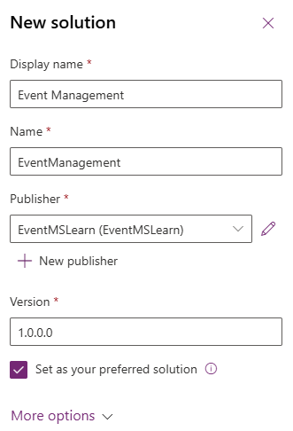

---
lab:
  title: 实验室 1：创建解决方案
  learning path: 'Learning Path: Manage the Microsoft Power Platform environment'
  module: 'Module 1: Describe Microsoft Dataverse'
---

## 学习目标

在本练习中，你将创建一个 Power Platform 解决方案来存储生成的各种组件。 在 Power Platform 中，解决方案用于将不同的组件组合在一起，以便能够传输。 在本练习中创建的解决方案将在课程的其余部分使用。

### 场景

Contoso Consulting 是一家专门从事 IT 和 AI 咨询服务的专业服务组织。 他们全年为客户举办了很多各种各样的活动。 其中一些是贸易展览会风格的活动，他们邀请了许多合作伙伴前来参加这项活动，并提供了有关新产品、市场趋势和服务的详细信息。 其他全年都在举办的活动是网络研讨会，用于提供有关各个产品的详细信息。

Contoso 希望使用 Power Platform 构建活动管理解决方案，以用于管理他们全年举办的各种活动。

在本练习中，你将创建一个解决方案，该解决方案将用于应用程序生命周期管理 (ALM) 并将我们创建的所有不同应用、站点和流组合在一起，以便轻松管理和传输。

完成此练习预计需要 15 到 20 分钟的时间****。

成功完成本练习后，你将：

- 创建一个活动管理解决方案
- 将现有“帐户”表和“联系人”表添加到该解决方案。
- 从解决方案中创建名为“活动”的新表。

## 任务 1：创建一个活动管理解决方案

1.  打开 [Power Apps Maker portal](https://make.powerapps.com)。
1.  导航到“解决方案”****。
1.  在命令栏上选择“+ 新建解决方案”****。
1.  在新的解决方案屏幕中，按如下所示进行配置：
    - 显示名称：**** 事件管理
    - **名称：** EventManagement
1.  在“发布者”下，选择“+ 新建发布者”********
1.  按如下所示，配置新发布者
    - 显示名称：**** EventMSLearn
    - **名称：** EventMSLearn
    - 前缀：mslearn****
    - 选项值前缀：**** 保留默认值

    

1.  选择“保存”按钮以保存发布者****。
1.  在“发布者”字段中，选择刚刚创建的 EventMSlearn 发布者********。
1.  选择“设置为首选解决方案”****。

    

1.  选择“创建”以创建解决方案****。

## 任务 2：将现有组件添加到解决方案。

现在我们已经创建了用于存储组件的解决方案后，接下来将向其添加一些现有表。 我们将添加“帐户”和“联系人”表，以便在不同的活动管理的应用、流和站点中轻松使用这些表。 首先，我们将“帐户”表添加到解决方案。

1.  如有必要，请转到在上一任务中创建的“活动管理”解决方案****。
1.  在命令栏中，选择“添加现有”********。
1.  从显示的菜单中，选择“表”****。
1.  选择“帐户”表，然后选择“下一步”********。
1.  在“所选表”屏幕上，选择“包括所有对象”********。
1.  选择 **添加** 。

    现在我们已经有了“帐户”表，接下来将添加“联系人”表。

1.  在命令栏上，再次选择“添加现有”按钮********。
1.  从显示的菜单中，选择“表”****。
1.  选择“联系人”表，然后选择“下一步”********。
1.  在“所选表”屏幕上，选择“包括所有对象”********
1.  选择“添加”****

    

恭喜。 你已成功使用 Power Platform 创建了一个新的解决方案。 我们将继续使用该解决方案向其添加其他组件。
