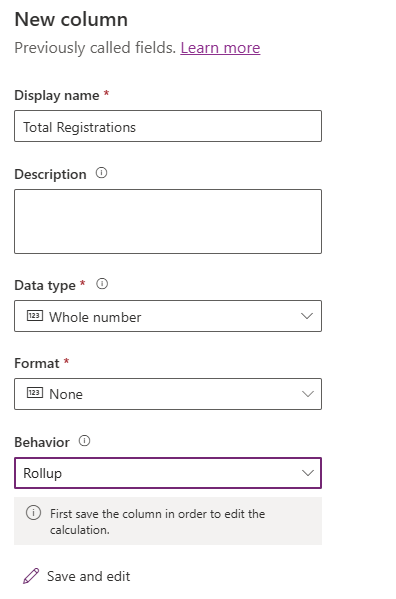

---
lab:
  title: 实验室 2：创建数据模型
  learning path: 'Learning Path: Manage the Microsoft Power Platform environment'
  module: 'Module 1: Describe Microsoft Dataverse'
---

## 学习目标

在本练习中，学员将使用 Copilot 构建数据模型。 你需要提供要生成的表类型的说明，并根据需要使用设计器进行更改，例如添加其他列。

成功完成此实验室后，你将：

- 使用 Copilot 辅助你创建数据模型。
- 向表添加列并进行编辑。

### 场景

Contoso Consulting 是一家专门从事 IT 和 AI 咨询服务的专业服务组织。 他们全年为客户举办了很多各种各样的活动。 其中一些是贸易展览会风格的活动，他们邀请了许多合作伙伴前来参加这项活动，并提供了有关新产品、市场趋势和服务的详细信息。 其他全年都在举办的活动是网络研讨会，用于提供有关各个产品的详细信息。

Contoso 希望使用 Power Platform 构建活动管理解决方案，以用于管理他们全年举办的各种活动。 此外，Contoso 还希望构建一些应用程序来支持其“员工设备借用”计划。 

在本练习中，你将创建一个数据模式，用于存储 Contoso 有效管理其活动所需的不同类型的活动、活动报名和其他数据。 你还将创建一个“设备”表，该表将用于其他应用程序。  

### 实验室详细信息

在开始本练习之前，建议已完成：

- 实验室 1 - 创建解决方案****

> **重要提示：** 此实验室使用 AI 构建组件。 由于 AI 结果可能会有所不同，因此请务必注意，该结果可能与实验室中的定义不同（但类似）。 无论创建什么内容或其命名是什么，实验室中概述的基本概念都是一样的。 如果表和列不完全匹配，则可能需要进行调整以适应已为你创建的内容。

### 实验室安排

完成此练习预计需要 30 到 45 分钟的时间****。

> **注意：** 在上一个实验室中，我们创建了一个“活动管理”解决方案，并将其设置为此环境中的首选解决方案。 因此，我们不需要直接转到该解决方案来创建数据模型。 我们创建的项目将自动添加到该解决方案。

## 任务 1：创建数据模型

Contoso 当前在其 Dataverse 实例中存储捐赠者联系信息。 他们希望使用 Dataverse 跟踪他们申请的拨款以及他们收到的捐款。 你需要创建支持 Contoso 未来的应用程序需求所需的表。

1.  如有必要，请打开 Web 浏览器并导航到 [Power Apps](https://make.powerapps.com/) Maker Portal，并使用 Microsoft 帐户凭据登录。
2.  在 Power Pages 主屏幕上，使用左侧的导航选择“表”****。
3.  在“表”下，选择“开始使用 Copilot”********。
4.  在“描述希望 Copilot 生成的表”屏幕中，输入****：“创建用于管理活动的表。** 该表应标识活动的名称、活动数据、位置、最大与会者人数和活动详细信息。”
5.  在“生成”按钮旁边，选择“表设置”，并按如下所示进行配置********：
    - 表选项：**** 一个表
    - 请勿包含关系****。

6.  选择“**生成**”按钮。

> **重要提示：** Copilot 应仅创建一个名为“活动”的表****。 如果创建了更多的表，则需要通过告诉 Copilot 要删除的表的名称来删除它们****。 未能移除任何额外的表将影响下一步。****

**使用 Copilot 编辑数据模型**

现在我们已经创建了表，接下来将向其添加一些附加列。 首先添加“活动类型”列。 此外，联系人会出席我们的活动。 我们希望将现有“联系人”表添加到数据模型，并稍后将其与“活动报名”相关联。

7.  在“想要在下一步执行的操作”字段中，输入****：“添加名为‘活动类型’的选项列”。**
8.  通过输入以下文本添加另一列：“添加名为‘是否需要报名’的选项列”**。

> **重要提示：**“活动”表不必完全匹配上述图像，但至少应包含以下列：
- 事件名称
- 事件日期
- 最大与会者人数
- 位置
- 事件类型
- 是否需要报名。
如果没有上述所有列，请使用 Copilot 将它们添加到数据模型。  

接下来，让我们将“联系人”表添加到数据模型****。

9.  在顶部的命令栏中，选择“+ 现有表”********。
10.  在“搜索”字段中，输入“联系人”，然后选择“添加”************。

根据活动类型，可能有一个或多个会议。 若要管理不同的会议，我们需要定义会议内容及其关联的活动。 接下来，我们会使用 Copilot 创建“活动会议”表。

11.  在“想要在下一步执行的操作”字段中，输入****：“添加名为‘活动会议’的新表。”**

Copilot 可能会创建两个表：活动会议和活动演讲者。 由于“联系人”会是演讲者，因此我们将移除“活动演讲者”表。

12.  如有必要，在“想要在下一步执行的操作”字段中，输入****：“移除‘活动演讲者’表。”**
13.  在 Copilot 中，输入以下文本：“向名为‘会议说明’的‘活动会议’表添加新的文本列。”**

接下来，我们将添加最后一个名为“会议报名”的表。 此表用于管理报名参加特定会议的个人。

14.  在 Copilot 中，输入以下文本：“添加名为‘会议报名’的新表。”**

Copilot 可能会创建两个表：会议报名、会议或参与者（或其他表）。 由于联系人可以是参与者，因此我们将移除“参与者”表。 如果创建了“会议报名”以外的任何其他表（如‘会议’或其他表），请将其移除。

15.  在 Copilot 中，输入以下文本：“移除‘参与者’表。”**
    
有时，“参与者姓名”列将添加到“会议报名”表中。 我们需要移除该列，因为当我们稍后尝试保存数据模型时，它可能会导致问题。 （稍后我们会将其替换为其他参与者列。）  

16. 如有必要，请在 Copilot 中输入以下文本：“从‘会议报名’表中移除‘参与者姓名’列。”

17. 如果现在具有“主列”字段，请输入以下文本：将“主列”重命名为“报名名称”。**

18.  在 Copilot 中，输入以下文本：“向名为‘特殊说明’的‘会议报名’表添加文本列。”**

已完成的“会议报名”表应类似于下图：

> 重要说明：虽然不需要完全匹配，但重要的是要不含名为“参与者”的列，并且至少具有以下列****：
- 报名名称
- 会议日期
- 特殊说明

现在，我们将在不同的表之间创建关系。 由于联系人记录可以是会议中的演讲者，因此我们将在“联系人”和“活动会议”表之间创建关系。

18.  在命令栏上，选择“创建关系”****。
19.  按如下所示配置关系：
- 关系类型：**** 一对多
- 一个：**** 联系信息
- 多个：**** 活动会议
- 显示名称：**** 主讲人
20.  选择“完成”。****

由于联系人可以在会议中报名参加会议，因此我们将在“联系人”和“会议报名”表之间创建关系。

21.  在命令栏上，选择“创建关系”********。
22.  按如下所示配置关系：
- 关系类型：**** 一对多
- 一个：**** 联系信息
- 多个：**** 会议报名
- 显示名称：**** 参与者

23.  选择“完成”。****

单个活动可以关联多个会议，因此我们将在“活动”表与“活动会议”表之间创建关系。

24.  在命令栏上，选择“创建关系”********。
25.  按如下所示配置关系：
- 关系类型：**** 一对多
- 一个：**** 事件
- 多个：**** 活动会议
- 显示名称：**** 事件

26. 选择“完成”。****

最后，参与者报名参加活动会议，因此我们需要在“活动会议”表和“会议报名”表之间创建关系。

27.  在命令栏上，选择“创建关系”********。
28.  按如下所示配置关系：
- 关系类型：**** 一对多
- 一个：**** 活动会议
- 多个：**** 会议报名
- 显示名称：**** 活动会议

29.  选择“完成”。****

新创建的数据模型应类似于下图：

30.  选择“保存并退出”****。

## 任务 2：直接编辑表和列

Copilot 是快速创建表和列的绝佳方法。 但有时可能需要直接修改表和列。 例如，在此任务中，我们将更新一些现有列，并跟踪报名参加特定会议的参与者人数。

1.  如有必要，请打开 Web 浏览器并导航到 [Power Apps](https://make.powerapps.com/) Maker Portal，并使用 Microsoft 帐户凭据登录。
2.  使用左侧导航栏，选择“表”。
3.  在“搜索”字段中，输入“活动”********。
4.  打开“活动”表****。
5.  在“架构”标题下，选择“列”********。
6.  找到并打开“活动类型”列****。
7.  将标签替换为以下内容：
    - 会议
    - 贸易展览
    - 网络研讨会
    - 午餐学习会
    - 启动
8.  将“默认选项”设置为“无”********。

9.  选择“保存”按钮。**** （如果列第一次无法保存，请重试。**）

接下来，我们将向“活动会议”表添加新列，以跟踪会议报名总数****。

10.  使用左侧的导航，选择“表”以离开“活动”表********。
11.  在“搜索”字段中，输入“活动”********。
12.  打开“活动会议”表****。
13.  在“架构”标题下，选择“列”********。
14.  在命令栏上，选择“新建列”按钮****。
15.  按如下所示配置新列：
    - **显示名称：** 报名总数
    - **数据类型：** 整数
    - 行为****：汇总

16.  选择**保存并编辑**。

> **重要提示：** 如果已开启弹出窗口阻止程序，可能需要将其关闭才能显示“汇总”字段。

17.  按如下所示配置“汇总”列：
- 在“相关实体”下，选择“添加相关实体”********。
- 选择“会议报名”表****。
- 选择“保存更改”按钮（复选标记）******
- 在“聚合”下，选择“添加聚合”********。
- 在“聚合函数”下，选择“计数”********。
- 对于“聚合相关实体”字段，请选择“会议报名”********。
- 选择“保存更改”按钮（复选标记）******

18.  选择“保存并关闭”按钮****。

你现在已经成功创建用于支持活动管理应用程序的数据模型。 

## 任务 3：创建“设备”表

除了管理活动之外，Contoso 还有一个员工的借用计划。  接下来，我们将创建表来存储设备。 
1.  使用左侧导航栏，选择“表”。
2.  在“表”下，选择“开始使用 Copilot”。********
3.  在“描述希望 Copilot 生成的表”屏幕中，输入****：“创建一个表以用于借用设备。** 该表应包括设备名称、截止日期和物品编号。”
4.  在“生成”按钮旁边，选择“表设置”，并按如下所示进行配置********：
- 表选项：**** 一个表
- 请勿包含关系****。

5. 选择“**生成**”按钮。

> **重要提示：** Copilot 应只创建一个名为“借用设备”的表****。 如果创建了更多的表，可以通过告诉 Copilot 要删除的表的名称来删除它们。

**使用 Copilot 编辑数据模型**

现在我们已经创建了表，接下来将向其添加一些附加列。 首先添加“活动类型”列。 此外，联系人会出席我们的活动。 我们希望将现有“联系人”表添加到数据模型，并稍后将其与“活动报名”相关联。
6.  在“想要在下一步执行的操作”字段中，输入****：“将表重命名为‘设备’。”**
7.  在“想要在下一步执行的操作”字段中，输入****：“添加名为‘设备类型’的选项列。”**
8.  通过输入以下文本添加另一列：“添加名为‘类别’的文本列。”**
9.  通过输入以下文本添加另一列：“添加名为‘状态’的文本列。”**

完成的表应类似于下图：

10. 如果表包含额外的列，则通过输入“删除[列名]列”来移除这些列**。
11. 在表与该图匹配后，选择“保存并退出”****。

## 任务 4：直接修改“设备”表

1.  如有必要，请打开 Web 浏览器并导航到 Power Apps Maker Portal，并使用 Microsoft 帐户凭据登录。
2.  使用左侧导航栏，选择“表”。
3.  在“搜索”字段中，输入“设备”。********
4.  打开“设备”表****。
5.  在“架构”标题下，选择“列”********。
6.  找到并打开“设备类型”列****。
7.  如有必要，请将标签替换为以下内容：
- 电子
- 家具
- 工具
- Accessories
8.  将“默认选项”设置为“无”********。

9.  选择“保存”按钮。 （如果列第一次无法保存，请重试。）

恭喜，你已成功在 Microsoft Dataverse 中创建数据模型。

