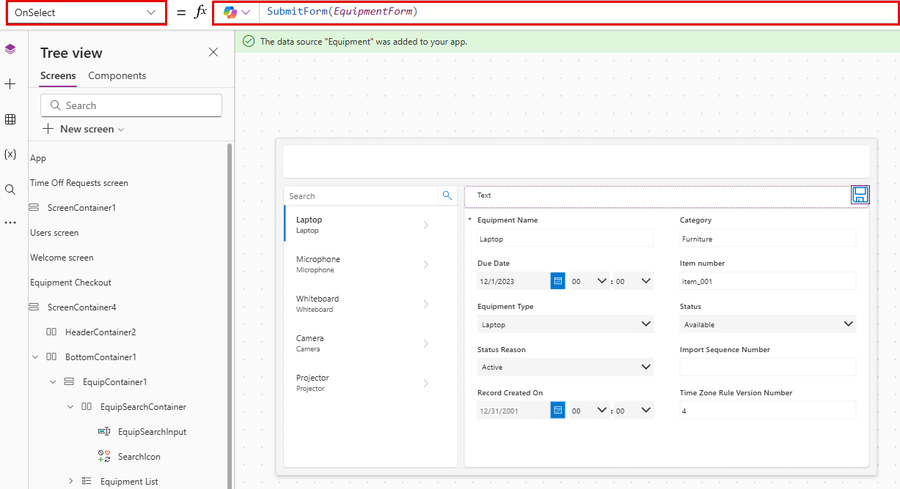

---
lab:
  title: 实验室 4：创建画布应用
  learning path: 'Learning Path: Demonstrate the capabilities of Microsoft Power Apps'
  module: 'Module 2: Build a canvas app'
---
## 学习目标

在本练习中，你将使用 Copilot 创建一个画布应用程序，员工可以使用该应用程序来请求和管理休假和设备借用请求。 创建该应用后，将使用 Copilot 和 Power Apps 设计器来修改应用。

成功完成此实验室后，你将：

- 使用 Copilot 辅助创建数据模型以支持应用。
- 修改画布应用程序。

### 场景

Contoso Consulting 是一家专门从事 IT 和 AI 咨询服务的专业服务组织。 他们希望创建一个休假应用程序，员工可以使用该应用程序请求休假。

### 实验室详细信息

在开始本练习之前，需要你已完成以下实验室：

- 实验室 2 – 创建数据模型****

> 重要提示 此实验室使用 AI 构建组件****。 由于 AI 结果可能会有所不同，因此请务必注意，该结果可能与实验室中的定义不同（但类似）。 无论创建什么内容或其命名是什么，实验室中概述的基本概念都是一样的。 如果表和列不完全匹配，则可能需要进行调整以适应已为你创建的内容。*

完成此练习预计需要 60 到 75 分钟的时间****。

## 任务 1：登录到 Power Apps 并浏览界面

1.  打开 Web 浏览器并导航到 [Power Apps](https://make.powerapps.com/) Maker Portal。
2.  使用左侧的导航，选择“创建”****。
3.  在“创建应用”下，选择“使用 Copilot 开始”********。
4.  在“描述希望 Copilot 生成的表”屏幕中，键入****：“我想存储员工发送的休假请求。 该表应标识请求的开始时间和结束时间。”
5.  选择“表选项”按钮****。 从显示的菜单中，选择“一个表”****。

6.  选择“**生成**”按钮。

Copilot 应已创建“休假请求”表****。 接下来，我们将向表添加更多列。

7.  在 Copilot 窗格中，输入****：“添加名为‘休假原因’的选项列。”**
8.  在 Copilot 窗格中，单独添加以下提示****。
    - “添加名为‘休假类型’的选项列。”**
    - “添加名为‘提交日期’的‘日期’列。”**
    - “向‘休假请求’表添加一个名为‘审批状态’的选项列。”**
    - “添加名为‘请求详细信息’的多行文本列。”**

    休假表应类似于下图：

接下来，我们会将用户表添加到数据模型，以便我们可以将休假请求与特定用户相关联。

9.  在命令栏上，选择“+ 现有表”********。
10.  从“推荐表”切换到“所有表”********。
11.  在“搜索”字段中，输入“用户”********。
12.  选择“用户”表，然后单击“添加所选”按钮********。
13.  在命令栏上，选择“创建关系”********。
14.  按如下所示配置关系：

-   一个：**** 用户
-   多个：**** 休假请求
-   **显示名称：** 发出请求的员工
  
15.  选择“完成”。****

已完成的数据模型应类似于下图：

16.  选择“保存并打开应用”按钮****。

> [!NOTE]
> 创建新应用可能需要几分钟时间。

## 任务 2：个性化新应用

现在已创建了新应用，接下来我们会对其进行一些修改，以最大限度地符合我们的需求。 我们需要首先对欢迎屏幕进行一些修改。

1.  打开新应用后，选择“休假请求”文本上方的图像占位符************。
2.  在显示的菜单中，选择“编辑”\>“上传”********。
3.  在类文件的文件夹中选择“休假”图像，然后选择“打开”********。
4.  接下来，选择“用户”上方的图像占位符********。
5.  在显示的菜单中，选择“编辑”\>“上传”********。
6.  在类文件的文件夹中选择“员工”图像，然后选择“打开”********。

接下来，我们调整图像的大小，使其便于用户阅读。 此外，我们将调整为每个项目显示的文本。

7.  在命令栏上，选择“属性”按钮********。 （位于“编辑”按钮右侧。**）
8.  选择之前添加的“休假”图像****。
9.  在“属性”面板中，按如下所示配置图像****：
    
    -   图像位置：**** 填充
    -   宽度：**** 300
    -   高度：**** 300
      
11.  重复前面的步骤，将“员工”图像的高度和宽度设置为 300 x 300********************。
12.  选择下面的文本“休假请求”****。
13.  在“属性”面板中，选择“文本”字段，并将文本更改为********：“创建、查看和管理休假请求。”**
14.  在“标题”中选择“欢迎屏幕”文本********。
15.  在右侧的“属性”窗格中，选择“徽标”字段********。
16.  从显示的菜单中，选择“上传”****。
17. 从类文件中选择“Contoso 徽标”，然后选择“打开”********。
18. 在“样式和主题”组下的“属性”面板中，选择“填充颜色”图标************。
19. 选择“自定义”选项卡****
20. 将十六进制颜色更改为****：101E2B****
21. 确保仍选择了“标题”，并将“标题”更改为“Contoso 员工中心”************。
22. 在命令栏上，选择“保存”按钮以保存应用********。
23. 在“保存”屏幕中，将“名称”设置为“Contoso 员工中心”，然后选择“保存”****************。

应用将类似于下图。

## 任务 3：向应用添加新屏幕。

在你构建应用时，一位经理找到你，想知道员工是否也可以使用此应用来借用设备。 Contoso 已在 Dataverse 中存储设备借用信息，因此只需在应用中提供信息即可。

1.  仍然将应用保持打开状态，展开 Copilot 窗格（如有必要）****。 在 Copilot 中，输入以下内容：“添加名为‘设备借用’的新屏幕。”**
2.  选择**Send**。
3.  选择“保留”按钮以接受屏幕****。
4.  一个名为“设备借用”的新屏幕已添加到应用****。
5.  在“设备借用”屏幕上，单击“使用布局”，然后选择“边栏”布局************。
6.  展开各种容器，直到看见 SideBarContainer****。

7.  右键单击“SidebarContainer”并重命名为“EquipContainer1”********。
8.  选中 EquipContainer1 容器后，单击“打开插入菜单”按钮********。
9.  在“搜索”窗口中，输入“库”，然后选择“垂直库”************。
10.  当系统提示你在显示的“搜索”字段中提供数据源时，请输入“设备”，然后选择“设备”表**********。
11. 在屏幕左侧的“树状视图”中，选择刚刚添加的“Gallery1”控件********。
12. 右键单击库名称，选择“重命名”，然后重命名为“设备列表”********。
13. 将鼠标悬停在“设备列表”库上，在库上方显示的工具栏上，选择“布局”********。
14. 选择“标题和副标题布局”选项****。
15. 选中“设备列表”库后，在“属性”窗格中，按如下所示进行配置********：

    -   宽度：**** 360
    -   高度可调：**** 启用
    -   最小高度：**** 287

接下来，我们将向 EquipmentContiner1 容器添加一个附加容器，以存储用于筛选“设备列表”库内容的搜索控件********。

16.  在树状视图中，选择“EquipContainer1”********。
17.  将鼠标悬停在容器上，然后选择“Copilot”图标****。
18.  输入以下文本：“插入水平容器。**”

19.  选择“保留”按钮****。
20.  新的容器将添加到 EquipContainer1 容器的底部****。
21.  在“树状视图”中，单击、按住并拖动新容器，将其置于“设备列表”库上方********。
22.  将容器重命名为“EquipSearchContainer”****。
23.  选中“EquipSearchContainer”后，在“属性”窗格中，按如下所示进行配置********：
    
 -   最小宽度：**** 0
 -   高度可调：**** 关
 -   高度：**** 44
   
24.  选中“EquipSearchContainer”后，选择“打开插入菜单”按钮********。
25. 在“搜索”字段中，输入“文本”，然后选择“文本输入”************。
26. 将“文本输入”字段重命名为“EquipSearchInput”********。
27. 选中“EquipSearchInput”后，在“属性”窗格中，按如下所示进行配置********：

    -   默认值：**** 空白(无)
    -   提示文本：**** 搜索
    -   字体：**** Open Sans
    -   字号：**** 14
    -   填充****（下面的值可能已经存在。）
        -   顶部：**** 5
        -   底部：**** 5
        -   左侧：**** 12
        -   右侧：**** 5
    -   高度：**** 44
    -   灵活宽度：**** 启用
    -   最小宽度：**** 0

        

28. 在树状视图中，选择“EquipSearchContainer”********。
29. 将鼠标悬停在容器上，选择“Copilot”图标，然后输入“添加‘搜索’图标”******。
30. 选择“**保留它**”。

> **注意：** 如果 Coplot 碰巧添加了错误的图标，请将其移除并手动插入放大镜。

31. 选中“搜索”图标后，在“属性”窗格中，按如下所示配置控件********：

    -   **填充**
        -   顶部：**** 10
        -   底部：**** 10
        -   左侧：**** 10
        -   右侧：**** 10
    -   高度：**** 44
    -   宽度：**** 44

32. 使用左侧的树状视图，选择“EquipSearchContainer”********。
33. 在“属性”窗格中，按如下所示配置容器****：

    -   最小宽度：**** 0
    -   高度：**** 44

最后，我们将配置“设备列表”库，以基于“搜索控件”字段中输入的文本填充其数据****。

34.  选择之前创建的“设备列表”库****。
35.  在“项目”属性中，输入以下公式****：Search([@'Equipments'], *EquipSearchInput*.Text, 'Equipment Name',Category)

36. 在命令栏上，选择“保存”按钮以保存应用********。

> **重要提示：** 如果已将公式复制粘贴到编辑栏中，则 '' 对于设备和设备名称可能不正确。 如果收到公式错误，请尝试移除公式并重新键入。

## 任务 4：生成用于显示记录操作的容器。

当用户在“设备”列表中选择记录时，我们希望在另一个容器中打开该记录，以允许他们编辑所选记录。

1.  选择“MainContainer”并将其重命名为“DetailsContainer”********。
2.  在“DetailsContainer”上，选择“插入”按钮********。
3.  在“搜索”中，输入“容器”，然后选择“垂直容器”************。
4.  右键单击“重命名”，将容器重命名为“RecordDetails”********。
5.  在 RecordDetails 容器上，选择“插入”按钮********。
6.  在“插入”菜单上，选择“编辑窗体”********。
7.  在“选择数据源”屏幕中，选择“设备”****。 （填充数据最多可能需要 30 秒。）**
8.  右键单击刚刚添加的窗体，将其重命名为“EquipmentForm”********。
9.  在“属性”窗格中，选择“高级”选项卡并将“项目”属性设置为************：*'Equipment List'*.Selected。 （这将使用当前选定的记录填充窗体。）**
10. 选择“显示”选项卡，并按如下所示配置窗体****：

    -   列数：**** 2
    -   默认模式：**** 编辑

现在，我们将添加另一个容器，用于控制窗体上的操作。

11.  确保已选择“DetailsContainer”****。
12.  选择显示的“Copilot”图标****。 输入以下内容：“插入水平容器。”**
13.  选择“**保留它**”。
14.  右键单击容器，并将其重命名为“SelectedRecord1”********
15.  使用树状视图，将 SelectedRecord1 容器移到 RecordDetails 容器上方************。
16.  按如下所示配置 SelectedRecord1 容器****：
    
-   最小宽度：**** 250
-   高度可调：**** 关
-   **Height**：50
    
18.  选中 SelectedRecord1 容器后，选择“插入”按钮********。
19.  选择“文本标签”****。
20.  将标签重命名为“SelectedRecordTitle”****。
21. 按如下所示配置 SelectedRecordTitle****：

    1.  **填充**
        1.  顶部：**** 5
        2.  底部：**** 5
        3.  左侧：**** 30
        4.  高度：**** 40
    2.  灵活宽度：**** 启用
    3.  最小宽度：**** 150
       
23. 选择 SecondRecord1 容器，选择“插入”按钮********。
24. 在“搜索”字段中，输入“保存”，然后选择“保存”图标************。
25. 按如下所示配置“保存”按钮****：

    -   高度：**** 40
    -   **Width**: 40
      
27. 选择“OnSelect”属性并输入以下公式****：SubmitForm(EquipmentForm)。

## 任务 5：修改页面上的页眉

创建此屏幕的最后一步是使用数据填充读取器容器。

1.  选择应用顶部的“HeaderContainer”****。
2.  选择“插入”按钮****。
3.  选择**文本标签**。
4.  按如下所示配置“文本标签”控件****：
   
    -   文本：**** 设备借用
    -   字体：**** Open Sans
    -   字号：**** 16
    -   字体粗细：**** 半粗体
        -   填充：**** 16
        -   底部：**** 16
        -   左侧：**** 16
        -   右侧：**** 16
    -   高度：**** 40
    -   灵活宽度：**** 启用

        

6.  选择“HeaderContainer”，选择“插入”，然后选择“主页”图标************。
7.  将“主页”按钮的“OnSelect”属性设置为****：Back()

## 任务 6：完成欢迎屏幕的配置

经过仔细考虑，我们决定不需要具有在此应用中创建用户这项功能，因此我们将更改欢迎屏幕，以便你能够访问设备借用。

7.  使用树状视图，选择“欢迎屏幕”********。
8.  选择“用户”上方“图像”********。
9.  从显示的菜单中选择“编辑”，然后选择“上传”********。
10.  在学生文件夹中找到“设备”图像，然后选择“打开”********。
11.  将该图像的“OnSelect”属性设置为****：Navigate(*'Equipment Checkout'*)
12.  选择“用户”文本并将“文本”属性设置为“设备”************。
13.  选择“设备”下方的“文本”，并将“文本”属性更改为************：租用设备并编辑预留。

14. 选择“保存”按钮以保存应用****。

## 任务 7：测试应用程序

1.  在命令栏上，选择“运行”按钮********。
2.  选择“设备”图像****。
3.  在“搜索”字段中，输入“电子设备”********。 （请注意列表如何筛选**）
4.  选择“笔记本电脑”记录****。
5.  将“类别”更改为“家具”********。
6.  选择“保存”按钮。****
7.  请注意“笔记本电脑”类别如何更改为“家具”********。
8.  选择“主页”按钮****。
9.  选择紫色 X 以退出预览模式********。

## 任务 8：保存并发布应用

目标：**** 保存并发布应用，使其可在 Web 浏览器、移动设备或嵌入式平台（如 SharePoint 或 Teams）中访问。

1.  在 Power Apps Studio 中，选择“保存”按钮****。
2.  选择**发布**按钮。
3.  选择“发布此版本”****。
