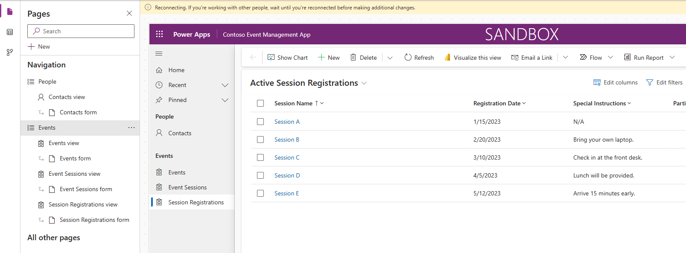
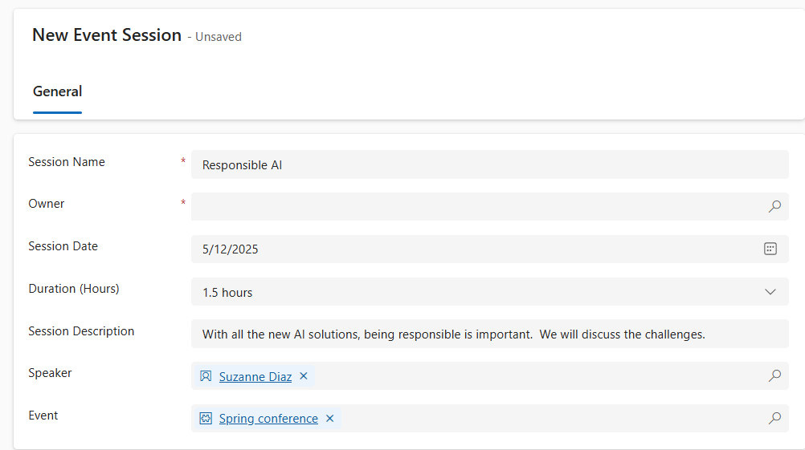

---
lab:
  title: 实验室 4：创建模型驱动应用
  learning path: 'Learning Path: Demonstrate the capabilities of Microsoft Power Apps'
  module: 'Module 3: Build a model-driven app'
---
## 学习目标

在本练习中，学员将使用 Copilot 在 Power Apps 中创建模型驱动应用。 你将定义数据模型、修改窗体和视图以及创建应用程序。

成功完成此实验室后，你将：****

-   生成模型驱动应用程序。
-   修改应用程序中的窗体和视图，以最大程度地满足你的需求。
-   浏览模型驱动应用程序。

### 场景

Contoso Consulting 是一家专门从事 IT 和 AI 咨询服务的专业服务组织。 他们全年为客户举办了很多各种各样的活动。 其中一些是贸易展览会风格的活动，他们邀请了许多合作伙伴前来参加这项活动，并提供了有关新产品、市场趋势和服务的详细信息。 其他全年都在举办的活动是网络研讨会，用于提供有关各个产品的详细信息。

Contoso 希望使用 Power Platform 构建活动管理解决方案，以用于管理他们全年举办的各种活动。

在本练习中，你将生成模型驱动应用程序来管理 Contoso 的活动。 模型驱动应用程序基于现有的数据模型，包括活动、活动会议和会议报名。

### 实验室详细信息：

在开始本练习之前，建议已完成：

-   实验室 1 - 创建解决方案****
-   实验室 2 – 创建数据模型****

完成此练习预计需要 20 到 30 分钟的时间****。

## 任务 1：创建数据模型以支持新的模型驱动应用程序

Contoso 当前在其 Dataverse 实例中存储联系人信息，以便使用 Dataverse 跟踪课程和课程报名。 你需要创建必要的表来支持应用程序，并基于该数据模型生成模型驱动应用程序。

1.  如有必要，请打开 Web 浏览器并导航到 [Power Apps](https://make.powerapps.com/) Maker Portal，并使用 Microsoft 帐户凭据登录。
1.  使用左侧导航栏，选择“**解决方案**”。
1.  打开之前创建的“活动管理”解决方案****。
1.  在命令栏上，选择“新建”\>“应用”\>“模型驱动应用”****************。
1.  选择“创建”部分****。
    -   **名称**：`Contoso Event Management`
    -   描述：****` Used to manage Events and Event Sessions`。
1.  选择“创建”按钮。
1.  选择“+ 添加页面”按钮，然后选择“Dataverse 表”********。
1.  选择下表：
    -   联系人
    -   活动
    -   事件会话
    -   会议报名
1.  请务必选择“在导航中显示”****。

    

1. 选择“添加”按钮。

> **注意：** 有时，在使用设计器时，系统会提示你登录。 选择“X”以取消登录屏幕。

## 任务 2：编辑模型驱动应用程序以满足需求

现在应用已创建，接下来我们将对应用程序的呈现方式进行一些更改。 我们希望有两个不同的组：人员和活动。 我们希望在“人员”组中具有“联系人”表，在“活动”组中具有所有“活动”表。

1.  在屏幕左侧的“导航”下，选择“新建组”********。
1.  在应用程序的右侧，展开“属性”面板****。
1.  将“标题”从“新建组”更改为“`People`”********。

    

1.  选择“人员”组中的省略号********。
1.  选择“新建组”****。
1.  在“属性”窗格中，将组的名称从“新建组”更改为“`Events`”********。
1.  将鼠标悬停在左侧的“会议报名”视图上，选择省略号，然后选择“下移”，将“会议报名”移动到“活动”组中********************。
1.  将鼠标悬停在左侧的“活动会议”视图上，选择省略号，然后选择“下移”，将“活动会议”移动到“活动”组中********************。
1.  将鼠标悬停在左侧的“活动”视图上，选择省略号，然后选择“下移”，将“活动”移动到“活动”组中********************。

    应用应类似于下图：

    

## 任务 3：在模型驱动应用程序中编辑各种窗体和视图

模型驱动应用程序使用窗体和视图向用户界面 (UI) 中的用户呈现数据。 我们将对这些项目进行一些更改。

1.  如有必要，请确保“Contoso 活动管理”应用在设计器中处于打开状态****。
1.  在屏幕左侧的“人员”组下，将鼠标悬停在“联系人”窗体上，然后选择“编辑”************。

    如果系统提示保存更改，请选择“保存并继续”****。

1.  在左侧的“表列”下，选择“新建表列”********。
1.  按如下所示配置表列：
    -   **显示名称**：`Contact Type`
    -   数据类型：**** 选项
    -   是否与全局选项同步：**** 否
1.  将第一个选项的“标签”设置为“演讲者”********。
1.  选择“+ 新建选项”，然后将标签设置为“参与者”********。
1.  选择“+ 新建选项”，然后将标签设置为“支持人员”********。

    

1.  选择“保存”按钮。****
1.  使用鼠标，选择“新建联系人”文本以选择窗体页眉****。 （页眉周围应显示紫色矩形）**
1. 在“表列”下的“搜索”字段中，输入“联系人”************。
1. 选择刚刚创建的“联系人类型”表列****。
1. “联系人类型”现在应显示在页眉中********。

    

1. 在窗体命令栏上，选择“保存并发布”按钮********。
1. 选择“后退箭头”按钮以返回到模型驱动应用程序设计器****
1. 在左侧“导航”下，将鼠标悬停在“联系人”视图上，然后选择“编辑”图标************。 （如果系统提示保存，请选择“保存并继续”。****）
1. 选择“+ 查看列”****。
1. 搜索“联系人类型”列并将其添加到视图中****。
1. 选择**保存并发布**按钮。
1. 选择“后退箭头”按钮以返回到模型驱动应用程序设计器****。

    接下来，我们将对其余窗体进行必要的更改。

1.  在“导航”下，选择“活动”视图********
    
    请注意，可能存在“EventDetails1”列****。 如果存在，我们会将其从视图中移除。 （如果不存在，可以跳到任务 4：****** 保存并发布）

1.  将鼠标悬停在“活动”视图上，然后选择“编辑”按钮********。

    当系统提示保存更改时，请选择“保存并继续”********。

1.  在“视图”上，选择“EventDetails1”旁边的箭头，然后从显示的菜单中选择“移除”************。

    

1.  选择**保存并发布**按钮。
1.  选择“后退箭头”按钮以返回到应用程序设计器****。
1.  在“导航”下，将鼠标悬停在“活动”窗体上，然后选择“编辑”****************。

    当系统提示保存更改时，请选择“保存并继续”****。

1.  选择“Event Details1”字段，然后按键盘上的删除键********。

    窗体应类似于下图：

    

    如果不完全匹配，只要图片中的所有字段都在便可。  

1.  选择“**保存并发布**”按钮。
1.  选择“后退箭头”按钮以返回到应用程序设计器****。

## 任务 4：保存并发布（如果窗体上没有“EventDetail1”字段，请在此处继续。

1.  在应用的命令栏上，选择“保存并发布”按钮********。

1.  选择“后退”按钮以返回到“活动管理”解决方案********。
1.  选择“返回解决方案”箭头，返回到 Power Apps Maker Portal********。
1.  选择后退箭头以返回到 Power Apps 主屏幕********。

## 任务 5：测试新的应用程序

现在已创建模型驱动应用程序，接下来我们将测试其功能。

首先，我们将添加几个联系人。

1.  使用左侧导航栏，选择“应用”****。
1.  将显示的应用从“我的应用”更改为“全部”********。
1.  将鼠标悬停在刚刚创建的“Contoso 活动管理”应用程序上，然后选择“运行”图标********。
1.  使用左侧导航栏，选择“联系人”****。
1.  在命令栏上，选择“+ 新建”按钮********。
1.  在“新建联系人”屏幕中，按如下所示进行配置****：
    -   名字：****`Suzanne`
    -   姓氏：****`Diaz`
    -   职务：****`Engineer`
1.  在窗体页眉中，选择“联系人类型”旁边的向下箭头****。
1.  将“联系人类型”设置为“演讲者”********。

    

1.  选择“保存”按钮以保存联系人，并使其保持打开状态****。
1. 选择“+ 新建”按钮。****
1. 在“新建联系人”屏幕中，按如下所示进行配置****：
    -   名字：**** Edgar
    -   姓氏：**** Swenson
    -   职称：**** 架构师
    -   电子邮件：**** 输入电子邮件地址（确保添加你自己的电子邮件地址）****。
1. 在窗体页眉中，选择“联系人类型”旁边的向下箭头****。
1. 将“联系人类型”设置为“参与者”********。
1. 选择“保存并关闭”按钮。

    接下来，我们将添加新活动。

1.  使用左侧导航栏，选择“活动”****。
1.  在命令栏上，选择“**+ 新建**”按钮。
1.  在“新建活动”屏幕中，按如下所示进行配置****：
    - **活动名称：**`Spring conference`。
    - 活动日期：**** 明天的日期。
    - 最大与会者人数：****`500`
    - 活动详细信息：****`Spring conference to showcase newest products and services from our supported vendors`。
    - 活动类型：**** 会议
    - **位置**：`Seattle`
    - 是否需要报名：**** 是/真

    

1.  选择“保存并关闭”按钮。

    接下来，我们将为活动添加新会议。

1.  使用左侧的导航，选择“活动会议”****。
1.  选择“+ 新建”按钮。****
1.  按如下所示配置“活动会议”****：
    - 会议名称：****`Responsible AI`
    - 会议日期：**** 明天的日期
    - **持续时间：** 1.5 小时
    - 会议说明：****`With all the new AI solutions, being responsible is important. We will discuss the challenges`。
    - 主讲人：****`Suzanne Diaz`
    - 活动：****`Spring Conference`

    

1.  选择“保存并关闭”按钮****。

    最后，我们将创建“会议报名”****。

1.  使用左侧的导航，选择“会议报名”****。
1.  在命令栏上，选择“+ 新建”********。
1.  按如下所示完成会议报名：
    - 报名名称：****`E, Swenson Registration`。
    - **所有者：** 原样保留
    - 报名日期：**** 今天的日期
    - 特殊说明：****`No Gluten`
    - 参与者：****`Edgar Swenson`
    - 活动会议：****`Responsible AI`

    

1.  选择“保存并关闭”按钮。

