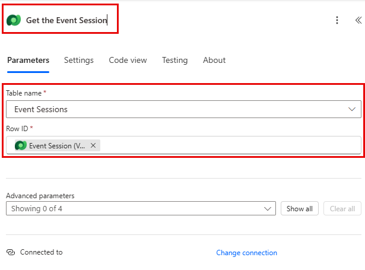
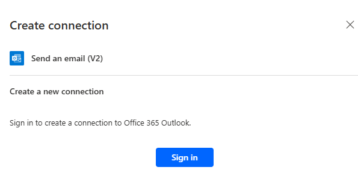
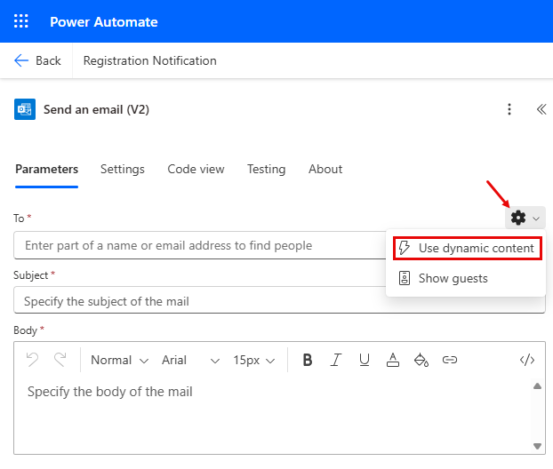

---
lab:
  title: 实验室 6：创建 Power Automate 流
  learning path: 'Learning Path: Demonstrate the capabilities of Microsoft Power Automate'
  module: 'Module 2: Build a Microsoft Power Automate flow'
---

## 学习目标

在本练习中，学员将使用 Power Automate 中的 Microsoft Copilot 创建一系列不同的云流。 你将使用 Copilot 等各种不同的创建方法，并从头开始熟悉可用的不同选项。

成功完成本练习后，你将：

- 使用自然语言提示设计工作流
- 配置触发器和操作
- 测试自动化的实际使用情况。

### 场景

Contoso Consulting 是一家专门从事 IT 和 AI 咨询服务的专业服务组织。 他们全年为客户举办了很多各种各样的活动。 其中一些是贸易展览会风格的活动，他们邀请了许多合作伙伴前来参加这项活动，并提供了有关新产品、市场趋势和服务的详细信息。 其他全年都在举办的活动是网络研讨会，用于提供有关各个产品的详细信息。 此外，Contoso 开始使用自动化智能体来帮助客户解决问题。

Contoso 希望使用 Power Automate 生成报名确认流，以便在客户报名参加活动时向其发送自动电子邮件。 

在本练习中，你将根据特定条件生成一系列 Power Automate 流。

在开始本练习之前，必须已完成以下实验室：

- 实验室 2 – 创建数据模型****
- 实验室 5：生成模型驱动应用****

完成此练习预计需要 20 到 30 分钟的时间。

## 练习 1：创建会议报名通知流

在这次的第一个练习中，你将生成一个流，该流将在创建新的会议报名时自动运行。 它将获取会议、活动和已报名的联系人的详细信息，并向其发送一封电子邮件，其中包含其报名详细信息。

### 任务 1：创建流

我们希望向任何新报名的用户发送报名确认函。 我们将创建一个流，用于捕获报名的详细信息，并向报名用户发送确认电子邮件。

1. 导航到 [https://make.powerautomate.com](https://make.powerautomate.com/)。

1. 你可能需要重新进行身份验证，请选择“登录”并根据需要按照说明进行操作****。

1. 选择右上角的“Dev One”环境（如果尚未选择）。**** （重要说明，请忘记执行此步骤）。

1. 在左侧导航上，选择“+ 创建”****。 （如果出现提示，请选择“开始”****。）

1. 选择“自动化云端流”****。

1. 输入 `Registration Notification` 作为流名称。

1. 在“选择流的触发器”中，搜索 `Dataverse`****。

1. 选择触发器“添加、修改或删除行时”，然后选择“创建”。********

    如果看到“参数无效”错误，这是因为尚未进行身份验证****。 按照以下步骤创建连接。 
    - 选择“更改连接”****。
    - 选择“添加新订阅”****。
    - 在“连接名称”字段中，输入“MOD 管理员”********。 将“身份验证类型”保留为“OAuth”，然后选择“登录”************。
    - 登录后，移动到步骤 9****。 

1. 填充流的触发条件：

    - 为“更改类型”选择“已添加”
    - 对于“表名称”，选择“会议报名”********。
    - 在触发器步骤中将“范围”选择为“组织”********。 

1. 将触发器步骤重命名为 `When a Session Registration is added`。

    

这是一个很好的习惯，这样你和其他流编辑可以理解步骤的目的，而不必深入研究细节。

### 任务 2：创建一个步骤来获取要报名参加的活动会议的详细信息。

1. 选择“+新建步骤”。 

1. 搜索“按 ID 获取行”****。 

1. 选择“按 ID 获取行”操作。

1. 选择“活动会议”作为“表名称”********

1. 选择“行 ID”字段。 请注意，图标显示为选择“动态内容”或“表达式”********。

1. 在“行 ID”字段中，从“动态内容”列表中选择“活动会议(值)”************。 在此步骤中，你将在“活动会议”中查找为触发此流而创建的“会议报名”********。

1. 选择“按 ID 获取行”操作****。 将此操作重命名为 `Get the Event Session`

    

    接下来，我们将获取会议所在活动的详细信息。

1. 在“获取活动会议”步骤下，选择“+ 插入操作”********。

1. 搜索“按 ID 获取行”****。 

1. 选择“按 ID 获取行”操作。

1. 选择“活动”作为“表名称”********

1. 选择“行 ID”字段。 请注意，图标显示为选择“动态内容”或“表达式”********。

1. 在“行 ID”字段中，从“动态内容”列表中选择“活动(值)”************。 在此步骤中，你将在“活动”中查找在上一步中捕获的“活动会议”********。

1. 选择“按 ID 获取行”操作****。 将此操作重命名为 `Get the Event`。

    

    最后，我们将获取报名参加会议的人员的详细信息。

1. 在“获取活动详细信息”下，设置“插入新操作”****。

1. 在“搜索”字段中输入“按 ID 获取行”****。

1. 选择“按 ID 获取行”****。

1. 选择“Contacts”作为“表名称”

1. 选择“行 ID”字段。 请注意，此时会弹出一个窗口，用于选择“动态内容”或“表达式” 。

1. 在“行 ID”字段中，从“动态内容”列表中选择“添加会议报名时”触发器中的“参与者(值)”字段****************。

1. 选择“按 ID 获取行”文本，然后将此作重命名为 `Get Participant Details`****。

    

### 任务 3：创建一个步骤以发送电子邮件，确认会议报名

1. 在“获取参与者详细信息”步骤下，选择“插入新操作”********。

1. 在“搜索”字段中，输入“发送电子邮件”****。

1. 选择**发送电子邮件 (V2)**。

    系统可能会提示你创建与 Outlook 的连接，如果是这样，请选择“登录”按钮，然后使用“Mod 管理员”帐户登录********。 

    

1. 在“收件人”字段正上方，选择“齿轮”图标********。 从显示的菜单中选择“使用动态内容”****。

     

1. 使用“动态值”，在“收件人”字段中，选择“获取参与者详细信息”下的“电子邮件”************。

    

1. 在“主题”字段中，确保其显示“`Registration Confirmation`”****。

1. 在“电子邮件正文”中输入以下文本：

    > **注意：** 需将动态内容置于方括号中命名字段的位置。 建议先复制并粘贴所有文本，然后在正确的位置添加动态内容。

    *`Dear {First Name}, Thank you for registering for our upcoming session {Session Name} on {Event Date}. {Speaker} will be your speaker in this session. Your session is scheduled to last {Duration (Hours)}. Check out our other session at our {Event Name}.`*

    *`Best regards,`*

    *`Events Administration`*
    
    *`Contoso Consulting`*

    接下来，我们将用下面概述的项目替换括号中的文本。

1. 突出显示 {First Name} 文本。 将其替换为“获取参与者详细信息”步骤中的“名字”字段********。

1. 突出显示“{Session Name}”文本****。 将其替换为“获取活动会议”步骤中的“会议名称”字段********。

1. 突出显示“{Event Date}”文本****。 将其替换为“获取活动详细信息”步骤中的“活动日期”字段********。

1. 突出显示“{Speaker}”文本****。 将其替换为“获取活动会议”步骤中的“演讲者(值)”字段********。

1. 突出显示“{Duration (Hours)}”文本****。 将其替换为“获取活动会议”步骤中的“持续时间(小时)”字段********。

1. 突出显示“{Event Name}”文本****。 将其替换为“获取活动详细信息”步骤中的“活动名称”字段********。

    完成的步骤应类似于下图：

    

1. 选择“保存”。

    将此流选项卡保持打开状态以用于下一个任务。 流应如下所示：

### 任务 4：输入一些示例数据

> **注意：** 如果已完成“实验室 5 – 生成模型驱动应用”，则可以跳过此任务并直接转到任务 5。 

1. 使用左侧导航栏，选择“应用”****。

1. 将显示的应用从“我的应用”更改为“全部”********。

1. 将鼠标悬停在“活动管理”应用程序上，选择“播放”图标********。

1. 使用左侧导航栏，选择“联系人”****。

1. 在命令栏上，选择“**+ 新建**”按钮。

1. 在“新建联系人”屏幕中，按如下所示进行配置****：

    - 名字：**** Suzanne

    - 姓氏：**** Diaz

    - 职称：**** 工程

1. 在窗体页眉中，选择“联系人类型”旁边的向下箭头****。

1. 将“联系人类型”设置为“演讲者”********。
    

1. 选择“保存”按钮以保存联系人，并使其保持打开状态****。

1. 选择“+ 新建”按钮。****

1. 在“新建联系人”屏幕中，按如下所示进行配置****：

    - 名字：**** Edgar

    - 姓氏：**** Swenson

    - 职称：**** 架构师

    - 电子邮件：**** 输入电子邮件地址（这非常重要，否则流不会运行）

1. 在窗体页眉中，选择“联系人类型”旁边的向下箭头****。

1. 将“联系人类型”设置为“参与者”********。

1. 选择**保存并关闭**按钮。

    接下来，我们将添加新活动。

1. 使用左侧导航栏，选择“活动”****。

1. 在命令栏上，选择“**+ 新建**”按钮。

1. 在“新建活动”屏幕中，按如下所示进行配置****：

    - 活动名称：**** 春季会议。

    - 活动日期：**** 明天的日期。

    - 最大与会者人数：**** 500

    - 活动详细信息：**** 通过春季会议展示我们支持的供应商的最新产品和服务。

    - 活动类型：**** 会议

    - **位置：** 西雅图

    - 是否需要报名：**** 是/真

    

1. 选择**保存并关闭**按钮。

    接下来，我们将为活动添加新会议。

1. 使用左侧的导航，选择“活动会议”****。

1. 选择“+ 新建”按钮。****

1. 按如下所示配置“活动会议”****：

    - 活动名称：**** 负责任的 AI

    - 会议日期：**** 明天的日期

    - **持续时间：** 1.5 小时

    - 会议说明：**** 对于所有新的 AI 解决方案，负责非常重要。 我们将讨论挑战。

    - 演讲者：**** Suzanne Diaz

    - **事件：** 春季会议

    

1. 选择“保存并关闭”按钮****。

 
### 任务 5：验证并测试流

1. 如有必要，在浏览器中打开新的标签页，然后导航到 [https://make.powerapps.com](https://make.powerapps.com/)。 

1. 选择右上角的“Dev One”环境（如果尚未选择）。****

1. 选择“应用”，然后打开“Contoso 活动管理应用”********。

1. 保持此浏览器标签页处于打开状态，然后导航回到流的上一个选项卡。

1. 在命令栏上，选择“测试”。 选择“手动”，然后选择“测试” 。

1. 导航到打开了模型驱动应用的浏览器标签页。

    最后，我们将创建“会议报名”****。

1. 使用左侧的导航，选择“会议报名”****。

1. 在命令栏上，选择“+ 新建”********。

1. 按如下所示完成会议报名：

    - **名称**：`E, Swenson Registration`。

    - 报名日期：**** 今天的日期

    - 参与者：****`Edgar Swenson`

    - 会议：****`Responsible AI`

    

1. 选择“保存并关闭”按钮。

1. 导航到正在运行流测试的浏览器标签页。 在短暂的延迟之后，你应该会看到流正在运行。 你可以在这里发现流中的任何问题，或确认它已成功运行。

短暂延迟后，应该会在收件箱中看到电子邮件。

> **注意：** 该邮件可能放在“垃圾邮件”文件夹中。

