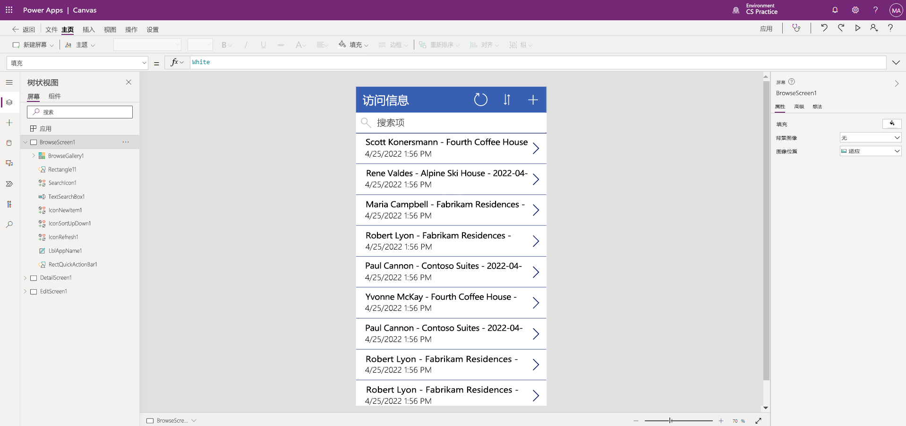

---
lab:
  title: 实验室 2：如何生成画布应用
  module: 'Module 3: Get started with Power Apps'
---

# 实验室 2：如何生成画布应用

**WWL 租户 - 使用条款** 如果在讲师引导式培训过程中向你提供租户，请注意，提供租户的目的是支持讲师引导式培训中的动手实验室。 租户不应共享或用于动手实验室以外的用途。 本课程使用的租户为试用租户，课程结束后无法使用或访问，不符合扩展条件。 租户不得转换为付费订阅。 在本课程中获得的租户仍然是 Microsoft Corporation 的财产，我们保留随时获取访问权限和收回的权利。 

## 方案

Bellows College 是一所教育机构，校园内有多座建筑。 目前，校园访问记录在纸质日报上。 无法始终如一地捕获信息，也无法收集和分析有关整个校园的访问数据。

目前，校园管理部门正在利用 Excel 电子表格来跟踪访客登记情况。 他们希望对其访客登记系统进行现代化改造。在该系统中，由安全人员控制对建筑物的访问，所有访问都必须由主办人预先登记和记录。

在整个课程中，你将生成应用程序并执行自动化，以使 Bellows College 的管理和安全人员可以管理和控制校园建筑的出入情况。

## 概要实验室步骤

我们将按照以下概要设计画布应用：

- 通过 Visit 表中的数据创建画布应用

- 配置访客在浏览屏幕上的显示方式

- 对应用进行一些基本更改

- 测试应用功能

## 先决条件

- 完成“模块 1 实验室 0 - 验证实验室环境”****
- 完成“模块 2 实验室 1 - 数据建模”

## 练习 1：创建访问画布应用

目的：在本练习中，你将通过连接之前创建的 Visits 表来创建画布应用。

### 任务 \#1：创建 Visits 应用

1.  导航到 `https://make.powerapps.com`

2.  你可能需要重新进行身份验证 - 选择“登录”并根据需要按照说明进行操作****。

3.  选择右上角的“Dev One”**** 环境（如果尚未选择）。

4.  从屏幕的左侧导航中，选择“+ 创建”。 在“开始”部分下，选择“Dataverse” 。

5.  选择 Dataverse 连接。

    > 注意：如果 Dataverse 连接不存在，请执行以下操作：
    > - 选择“+ 新建连接”
    > - 找到“Microsoft Dataverse”
    > - 选择“创建”
    > - 登录并选择“允许访问”

6.  查找并选择在上一个实验室中创建的 Visits 表。

7.  选择右下角的“连接”按钮。

8.  创建应用后，在“欢迎使用 Power Apps Studio”屏幕上，选中“不再向我显示此内容”，然后选择“跳过” 。

9.  创建完成后，画布应用应如下图所示：

    

10.  在应用设计器中，选择命令栏上的“预览应用”按钮（“播放”图标）。 （还可以通过按 F5 来预览应用。）到处浏览一下，看看你的应用刚打开时是什么样子的。

11. 通过选择屏幕右上角的 X 关闭应用预览。

恭喜，你已成功通过 Dataverse 表创建 Power App。 该过程的下一步是调整应用，使其符合 Bellows College 的品牌打造。 接下来的一系列步骤将引导你为该应用提供一些额外的自定义。

### 任务 \#2：修改新创建的应用并为其添加主题

在此任务中，你将在应用的三个屏幕（“浏览”、“详细信息”和“编辑”）上分别自定义标题文本并更改应用主题。 

1.  你现在位于“浏览”屏幕上。 选择屏幕上的“访问”标签。

1.  在屏幕右侧的“属性”选项卡下，将“文本”控件属性更新为“`Bellows College Visits`”

1.  在“属性”选项卡中，将“字号”更改为“24”  。 

1.  选择屏幕的空白背景以在“浏览”屏幕上查看更新后的文本。 

1.  使用左侧导航中的“树状视图”，选择“DetailScreen1” 。 

1.  选择屏幕上的“访问”标签。

1.  在屏幕右侧的“属性”选项卡下，将“文本”控件属性更新为 `Visit Details`

1.  单击屏幕的空白背景以在“详细信息”屏幕上查看更新后的文本。

1.  使用左侧导航中的“树状视图”，选择“EditScreen1”（可能需要向下滚动才能在树状视图上看到此选项） 。

1.  选择屏幕上的“访问”标签。

1.  在屏幕右侧的“属性”选项卡上，将“文本”控件属性中的文本替换为 `Edit Details`

1.  单击屏幕的空白背景以在“编辑”屏幕上查看更新后的文本。

1.  使用左侧导航中的“树状视图”，选择“BrowseScreen1” 。

1.  在命令工具栏上，选择“主题”按钮，然后从显示的列表中选择“红色”主题颜色 。

### 任务 \#3：测试 Visits 应用

在此任务中，你将测试新应用。

1.  在应用设计器中打开应用程序后，选择“设置”，在“常规”部分将应用名称更新为“`Visits App`”，然后选择“X”以关闭设置屏幕并选择“保存”   。

2.  使用左侧的导航，选择“BrowseScreen1”。

3.  在应用设计器中，选择命令栏上的“预览应用”按钮（“播放”图标）。 （还可以通过按 F5 来预览应用。）

4.  应用打开后，在“搜索项”字段中输入文本“`Maria`”（请注意，库中的项如何根据在搜索字段中键入的内容进行筛选）。

5.  显示“Maria Campbell”的“Contoso Suites”记录后，选择一行以导航并打开该访问的“详细信息”屏幕 。 （注意：如果显示多条 Contoso Suites Maria Campbell 记录，请选择其中任何一条记录。）

6.  若要编辑记录，请选择应用右上角的“铅笔”图标。

7.  可以在此处编辑“访问名称”，然后选择右上角的复选标记图标保存更改 。

8.  在屏幕右上角，选择 X 图标以关闭预览模式并返回到画布应用编辑器。

祝贺你！ 你已创建并配置了第一个画布应用。

