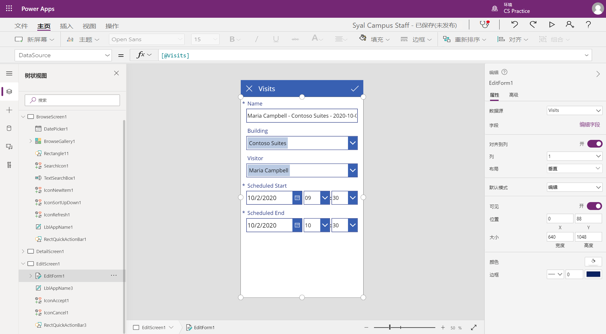
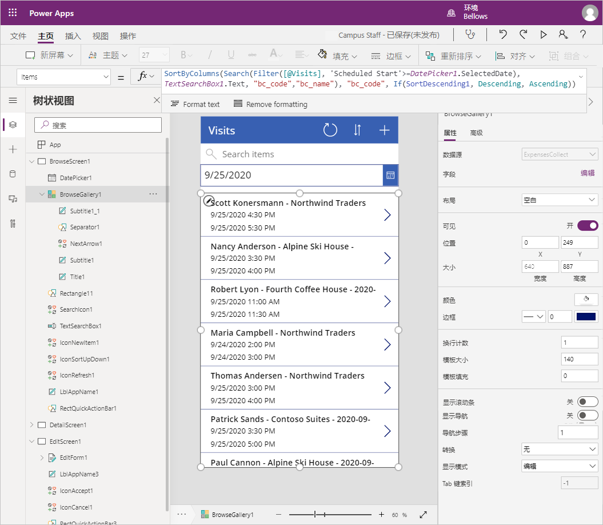

---
lab:
    title: '实验室 2：如何生成画布应用，第 1 部分'
    module: '模块 3：Power Apps 入门'
---

# 模块 3：Power Apps 入门

## 实验室：如何生成画布应用，第 1 部分

# 应用场景

Bellows College 是一所教育机构，校园内有多座建筑。目前，校园访问记录在纸质日报上。无法始终如一地捕获信息，也无法收集和分析有关整个校园的访问数据。 

校园管理部门希望对其访客登记系统进行现代化改造。在该系统中，由安全人员控制对建筑物的访问，所有访问都必须由主办人预先登记和记录。

在整个课程中，你将生成应用程序并执行自动化，以使 Bellows College 的管理和安全人员可以管理和控制校园建筑的出入情况。  

在本实验室第 1 部分，你将设计一个 Power Apps 画布应用，供大学员工管理来宾访问。

# 概要实验室步骤

我们将按照以下概要设计画布应用：

-   使用手机外形规格模板根据数据创建应用
-   配置包含访问信息的“详细信息”页面
-   配置用于创建访问的“编辑”页面
-   配置显示访问的库控件
-   在库数据源中添加筛选以仅显示将来的访问

## 先决条件

* 完成模块 **0 实验 0 - 验证实验室环境**
* 完成 **“模块 2 实验室 1 - Microsoft Dataverse 简介”**

## 开始前要考虑的事项

-   目标受众中最普遍的外形规格是什么？
-   估计系统中的记录数 
-   如何缩小所选记录的范围以提高应用的性能和用户采用率

# 练习 \#1：创建员工画布应用

**目标：** 在本练习中，要根据模板创建画布应用，然后对其进行修改以包括所需的数据。

## 任务 \#1：创建画布应用

在本任务中，你将使用基于 Microsoft Dataverse 的电话布局模板创建画布应用。使用 “Visits” 作为 Dataverse 中的选定表，模板将生成 “库 - 视图 - 编辑” 应用来管理校园访问。

1.  基于数据开始创建应用

    -   登录 <https://make.powerapps.com>

    -   在右上角选择你的“**环境**”（如果尚未将其设置为
        你的“实践”环境）。

    -   在主屏幕上，选择“**从数据开始**”中的“**Dataverse**”图标。

2.  连接到“访问”表
    
    -   选择“**+ 新建连接**”

    -   选择“**Microsoft Dataverse**”，然后单击“**创建**”

    -   找到并选择“**访问**”表

    -   选择“**连接**”

3.  可能会出现“**欢迎使用 Power Apps Studio**”窗口。单击“**跳过**”。

4.  保存应用程序

    -   单击“**文件**”\>“**保存**”。

    -   输入“[你的姓氏] 校园职工”作为“**应用名称**”。

    -   按“**保存**”。

## 任务 \#2：配置“访问详细信息”表单

在本任务中，你将配置“详细信息”表单以查看有关个人访问记录的信息。

1. 选择左上方的 **“后退”** 箭头以返回到应用定义。

2. 在 **“树视图”** 下展开 **“DetailScreen1”**

3.  选择 **“DetailForm1”**

4.  在右侧面板中，选择 **“字段”** 旁边的 **“编辑字段”**。

5.  单击 **“添加字段”**

6.  选择以下字段：

    * 实际结束
    
    * 实际开始
    
    * 建筑物 
    
    * 代码
    
    * 计划结束
    
    * 计划开始
    
    * 访问者
    
7.  单击 **“添加”**

8.  在 **“字段”** 窗格中，通过上下拖放字段名称来重新排列字段。推荐的顺序是：
    * 代码、名称、建筑物、访问者、计划开始时间、计划结束时间、实际开始时间、实际结束时间
    >**提示：** 可以通过单击字段名称旁边的向下箭头来折叠每个字段。

9.  通过单击字段名称旁边的省略号 (**…**) 并选择 **“删除”** 来删除 **“创建时间”** 字段。 

10.  关闭 **“字段”** 窗格。
 
11.  要保留正在进行的作业，请单击 **“文件”**，然后单击 **“保存”**。使用后退箭头返回到应用。

## 任务 \#3：配置“访问编辑”表单

在此任务中，你将配置一个表单来编辑个人访问行相关信息。

1.  在 **“树视图”** 下展开 **“EditScreen1”**

2.  选择 **“EditForm1”**

3.  选择 **“创建时间”** 字段，然后按下 **“Delete”** 键删除字段

4.  在“属性”面板中选择 **“编辑字段”**

5.  单击 **“添加字段”**

6.  选择以下字段：

    * 建筑物 
    
    * 计划结束
    
    * 计划开始
    
    * 访问者
    
7.  单击 **“添加”**

8.  在 **“字段”** 窗格中，通过上下拖放字段名称来重新排列字段。推荐的顺序是：
    
    * 名称、建筑物、访问者、计划开始时间、计划结束时间
    >**提示：** 可以通过单击字段名称旁边的向下箭头来折叠每个字段。 

9.  关闭 **“字段”** 窗格。

10.  要保留正在进行的作业，请单击 **“文件”**，然后单击 **“保存”**。使用后退箭头返回到应用。

屏幕看起来应大致如下：



## 任务 \#4：配置访问库

在此任务中，你将配置预先生成的库以显示访问的标题、开始日期和结束日期。 

1.  在 **“树视图”** 下展开 **“BrowseScreen1”**

2.  选择 **“BrowseGallery1”**

3.  从右侧的“高级属性”面板中选择 **“TemplateSize”** 属性。

4.  将表达式替换为以下 `Min(150, BrowseGallery1.Height - 60)`。这样可以确保有足够的空间来容纳其他信息。

5.  在应用预览版中，选择库中的第一个“日期时间”字段。

6.  在顶部编辑栏中，将 **ThisItem.'Created On'** 更改为 `ThisItem.'Scheduled Start'`

7.  再次选择字段

8.  按下 **CTRL+C**，然后按下 **CTRL+V**，以创建该字段的副本。

9.  使用鼠标或键盘，向下移动复制的控件，并将其与库中其他控件对齐，并位于其他“日期时间”字段下方。

10.  在顶部公式栏中，将 **ThisItem.'Scheduled Start'** 更改为 `ThisItem.'Scheduled End'`

11.  要保留正在进行的作业，请单击 **“文件”**，然后单击 **“保存”**。使用后退箭头返回到应用。

## 任务 #5：添加日期筛选器

由于访问量持续增长，因此用户需要一种可筛选访问库的功能。例如，用户可能只想查看将来的访问。在本任务中将添加一项功能，以便仅显示用户所选日期之后的访问。

1. 选择 **“BrowseScreen1”**

2. 选择顶部的 **“插入”** 菜单。

3. 单击 **“输入”** 并选择 **“日期选取器”**。

4. 使用键盘或鼠标，将控件置于搜索框下方。

5. 选择 **“BrowseGallery1”** 

6. 调整库控件的大小并移动控件，使其位于日期选取器下方并覆盖屏幕。为此，可以单击库控件顶部中心的调整大小图标，然后调整控件的大小使其在日期选取器之后开始。

7. 选择 **“BrowseGallery1”** 后，单击“属性”窗格的 **“高级”** 选项卡。

8. 找到 **“项”** 属性，然后在文本框中单击。

9. 在表达式中，找到 **[@Visits]**，然后将其替换为 `Filter(Visits,'Scheduled End' >= DatePicker1.SelectedDate)`。整个表达式应该如下所示：

   ```
   SortByColumns(
   	Search(
        Filter(
        	Visits,
            'Scheduled End' >= DatePicker1.SelectedDate
           ),
           TextSearchBox1.Text,
       	"bc_code","bc_name"
       ),
     "bc_scheduledstart",
     If(SortDescending1, Descending, Ascending)
   )
   ```
   
10. 要保留正在进行的作业，请单击 **“文件”**，然后单击 **“保存”**。使用后退箭头返回到应用。

屏幕看起来应大致如下：



# 练习 2：完成应用

在本练习中，你将测试该应用程序，一旦成功，就将其添加到解决方案中。

## 任务 \#1：测试应用

1.  启动应用程序

    -   选择 **“BrowseScreen1”** 并按功能键 **F5**，或单击右上角的 **“播放”** 图标来预览应用。
    
    -   该应用程序应加载并显示访问列表。 
    
    -   通过在日期选取器控件中选择不同的日期来测试筛选器
    
    -   选择一个访问并验证显示表单是否正常工作
    
    -   返回库，然后按 **+** 以创建一次新访问。验证编辑表单是否包含必填列，包括访客、建筑物以及计划的开始日期和结束日期。
    
    -   填写信息并提交。验证新记录是否出现在库中。
    
    -   至少再创建 2 次访问。
    
    -   按下 **“ESC”** 键或单击 **“X”** 图标以关闭预览模式。

2.  保存并发布应用程序

    -   单击 **“文件”**，如果显示 **“保存”** 按钮，请单击“保存”。

    -   单击 **“发布”**。

    -   请点击 **“发布此版本”**。

    -   单击 **“后退”** 箭头，导航回该应用。

    -   关闭 **“设计器”** 浏览器窗口或选项卡。

    -   如果在尝试关闭浏览器窗口时出现提示，请单击 **“离开”**。

## 任务 #2：将应用添加到解决方案并发布 

1. 打开校园管理解决方案。

   * 登录至 <https://make.powerapps.com>
   
   * 如果右上角显示的环境不是你的练习环境，请选择你**的环境**。 
   
   * 选择 **“解决方案”**。
   
   * 单击打开 **“校园管理”** 解决方案。
   
2. 选择 **“添加现有”**，然后单击 **“应用”**，然后单击 **“画布应用”**。

3. 选择“**外部 Dataverse**”选项卡。

4. 选择你的 **“校园职员”** 应用，单击 **“添加”**

5. 选择 **“发布所有自定义项”**。

# 挑战

* 所有访问的日历视图，并按日期范围筛选
* 能够创建和管理应用中的联系人
* 如何在一次访问中显示多个会议

