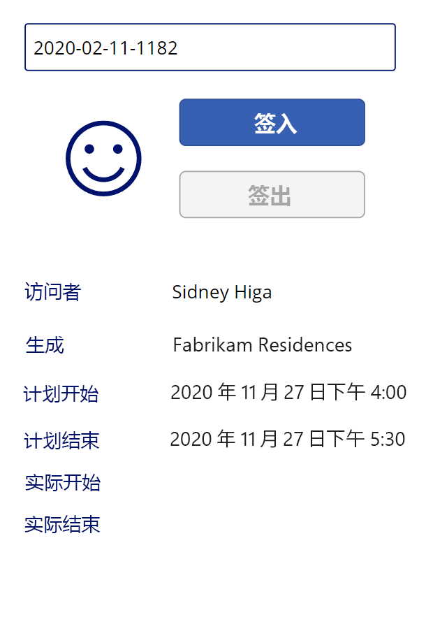

---
lab:
  title: 实验室 3：如何生成画布应用，第 2 部分
  module: 'Module 3: Get started with Power Apps'
ms.openlocfilehash: c26f032744e228dc6632d254ad127f39cdbdef02
ms.sourcegitcommit: ef58c858463b890e923ef808b1d43405423943fd
ms.translationtype: HT
ms.contentlocale: zh-CN
ms.lasthandoff: 01/27/2022
ms.locfileid: "137898857"
---
# <a name="module-3-get-started-with-power-apps"></a>模块 3：Power Apps 入门
## <a name="lab-2-how-to-build-a-canvas-app-part-2"></a>实验室 2：如何生成画布应用，第 2 部分

# <a name="scenario"></a>方案

Bellows College 是一所教育机构，校园内有多座建筑。 目前，校园访问记录在纸质日报上。 无法始终如一地捕获信息，也无法收集和分析有关整个校园的访问数据。 

校园管理部门希望对其访客登记系统进行现代化改造。在该系统中，由安全人员控制对建筑物的访问，所有访问都必须由主办人预先登记和记录。

在整个课程中，你将生成应用程序并执行自动化，以使 Bellows College 的管理和安全人员可以管理和控制校园建筑的出入情况。 

在本实验室的第 2 部分，你将创建设计并生成一个 Power Apps 画布应用，安全人员将在建筑入口使用该应用来快速确认和登记访问者。

# <a name="high-level-lab-steps"></a>概要实验室步骤

将按照以下大纲设计画布应用：

-   使用手机外形规格创建应用
-   连接到 Dataverse 作为数据源
-   捕获输入（访问者代码）并找到访问者行
-   配置表单查看器控件以显示访问者信息
-   使用 Dataverse 视图填充库
-   处理访问者的签入和签出流程

## <a name="prerequisites"></a>先决条件

* 完成“模块 0 实验室 0 - 验证实验室环境”
* 完成“模块 2 实验室 1 - Microsoft Dataverse 简介”

## <a name="things-to-consider-before-you-begin"></a>开始前要考虑的事项

-   安全管理人员需要快速访问哪些信息？
-   如果访问者代码无效该怎么办？
-   如果访问者在计划时间以外到该怎么办？

# <a name="exercise-1-create-security-canvas-app"></a>练习 \#1：创建安全画布应用

**目的：** 在本练习中，你将创建一个画布应用。

## <a name="task-1-create-canvas-app"></a>任务 \#1：创建画布应用

1.  打开校园管理解决方案。

    -   登录到 <https://make.powerapps.com>

    -   如果右上角显示的环境不是你的练习环境，请选择你的环境。 

    -   选择“解决方案”。

    -   单击打开“校园管理”解决方案。
    
2.  新建画布应用程序

    -   单击“新建”，然后选择“应用”\|“画布应用”。 

    -   在空白窗口中的画布应用中，在“应用名称”字段中输入“[你的姓氏]校园安全”。

    -   在“格式”字段中选择“电话”。

    -   单击“创建”。
        这将在新窗口中打开应用编辑器。 如果出现“欢迎使用 Power Apps Studio”对话框，单击“跳过”。
    
3.  保存画布应用

    -   单击“文件”，然后选择“另存为”。
    
    -   检查是否选择了“云”，单击“保存”。 

    - 验证“[你的姓氏]校园安全”作为名称，然后单击“保存”。 
        
    -   单击左上角的“后退”箭头（在 Power Apps 下方）返回到该应用。

3.  连接到数据源（访问）

    -   单击“查看”\|“数据源”
    
    -   单击“+ 添加字段”

    -   单击“查看所有表”
    
    -   选择“Visits”，并等待“Visit”表显示在“数据”选项卡上。
    
4.  要保留正在进行的作业，请单击“文件”，然后单击“保存” 。 使用后退箭头返回到应用。

## <a name="task-2-display-visitor-information"></a>任务 \#2：显示访问者信息

1.  添加搜索框

    -   选择左侧导航栏上的“树视图”选项卡。
    
    -   选择“Screen1”。
    
    -   前往“插入”选项卡。
    
    -   单击“文本”，然后选择“文本输入”。
    
2.  编辑文本输入对象

    -   在仍然选中“文本”输入对象的同时，选择“默认”属性中的文本并清除该值。
    
    -   选择“提示文本”属性，并输入 `"Enter visitor code"` 作为值（包括英文双引号）
    
    -   单击树视图中控件名称 (TextInput1) 旁边的 ...，然后选择“重命名”，将名称更改为 `textCode` 
    
3.  添加表单视图

    -   在“插入”选项卡上，单击“表单”，然后选择“显示”（你可能需要单击功能区右侧的向下箭头才能看到“表单”）  
   
    -   拖动以找到表单并与屏幕底部对齐
   
    -   在仍然选择新表单的同时，并选择“DataSource”属性，然后选择“Visits” 
   
    -   在“属性”窗格中，选择“水平”作为“布局”

4.  编辑表单视图

    -   在仍然选择新表单的同时，单击“编辑字段”

    -   删除“名称”和“创建日期”字段

    -   单击“添加字段”并选择以下字段：“实际结束时间”、“实际开始时间”、“建筑”、“计划结束时间”、“计划开始时间”、“访问者”
   
    -   按“添加”
   
    -   通过拖动列表中的字段卡来更改所选字段的顺序。 推荐的顺序是：“访客”、“建筑物”、“计划开始时间”、“计划结束时间”、“实际开始时间”、“实际结束时间”（可以折叠字段以使其更易于拖动）
   
    -   单击“X”关闭“字段”窗格
   
5.  在仍选择表单视图的同时，选择“属性”窗格的“高级”选项卡。 选择“项”属性并输入 `LookUp(Visits, Code = textCode.Text)` 

6.  要保留正在进行的作业，请单击“文件”，然后单击“保存” 。 使用后退箭头返回到应用。

7.  准备测试应用

    -   切换到包含解决方案的浏览器选项卡

    -   在弹出窗口中单击“完成”
   
    -   选择 Visit 表
   
    -   选择“数据”选项卡
   
    -   单击当前的视图名称“有效访问”，打开右上角的视图选择器
   
    -   将视图更改为“所有列”
   
    -   找到没有“实际开始时间”或“实际结束时间”值（即两列均为空）的“访问”行。 选择并复制该访问的“代码”。

8.  测试应用

    -   切换到应用的浏览器选项卡，按 F5 或单击右上角的播放图标，来预览应用。
   
    -   将复制的值粘贴到搜索文本框，验证记录是否显示在表单中
   
9.  清除搜索文本框的内容。
   
10.  按 ESC 退出正在运行的应用。

## <a name="task-3-add-check-in-and-check-out-buttons"></a>任务 \#3：添加签入和签出按钮

在此任务中，我们将创建用户用于签入和签出访问的按钮。 

1. 将搜索结果保存到变量中以在整个控件中重复使用

    * 选择“textCode”控件
   
    * 在属性窗格中，选择“高级”选项卡并选择“OnChange”属性
   
    * 输入以下表达式 `Set(Visit, LookUp(Visits, Code = textCode.Text))`
    
    > 当用户在 textCode 搜索框中搜索时，这会将访问保存在全局变量中。 这使我们可以在整个应用中使用变量 Visit，而无需重新输入整个查找表达式。

2. 添加“签入”按钮

   * 选择“插入”选项卡
   
   * 单击“按钮”
   
   * 在“属性”窗格中，将按钮“文本”属性更改为“`Check In`”（你可以在现有引号中输入）
   
   * 单击树视图中按钮名称 (Button1) 旁边的 ...，选择“重命名”，将名称更改为 `CheckInButton` 

3. 添加“签出”按钮   

   * 在“插入”选项卡上单击“按钮”，插入另一个按钮
   
   * 在“属性”窗格中，将按钮“文本”属性更改为“`Check Out`”（你可以在现有引号中输入）
   
   * 将按钮重命名为 `CheckOutButton`
   
   * 将这些按钮放置在搜索框下方，其中“签入”位于“签出”上方 
   
## <a name="task-4-enable-and-disable-buttons-depending-on-visit-data"></a>任务 \#4：根据访问数据启用和禁用按钮

用户查看访问后，我们希望他们使用“签入”按钮登记此次访问。 如果已找到访问记录（非空）、记录状态为活动且访问尚未开始（即实际开始值为空），那么我们会启用“签入”按钮。

1. 选择“签入”按钮，然后在“属性”选项卡中单击按钮的“显示模式”属性

2. 在函数栏中输入以下表达式：

      ```
      If(!IsBlank(Visit) 
      && Visit.Status = 'Status (Visits)'.Active
      && IsBlank(Visit.'Actual Start'),
          DisplayMode.Edit,
          DisplayMode.Disabled
      )
      ```

   该表达式可以按如下方式分解：

   * !IsBlank(Visit) - 已找到访问记录
   * && - 逻辑 AND 运算符
   * Visit.Status = 'Status (Visits) '.Active 记录状态为“活动”
   * IsBlank (Visit.'Actual Start') - 活动开始字段中没有任何数据
   * DisplayMode.Edit、DisplayMode.Disabled - 如果满足以上条件，按钮将变为可编辑状态。 否则，按钮将保持禁用状态。

如果已找到访问记录（非空）、记录状态为活动且访问已经开始（即实际开始值为非空），那么我们会启用“签出”按钮。

3. 选择“签出”按钮，然后在“属性”选项卡中单击按钮的“显示模式”属性

4. 在函数栏中输入以下表达式：

     ```
     If(!IsBlank(Visit) 
     && Visit.Status = 'Status (Visits)'.Active
     && !IsBlank(Visit.'Actual Start'),
         DisplayMode.Edit,
         DisplayMode.Disabled
     )
     ```

5. 要保留正在进行的作业，请单击“文件”，然后单击“保存” 。 使用后退箭头返回到应用。

6. 按 **F5** 运行该应用。 

7. 两个按钮均应禁用。 输入先前复制的代码值，然后按 Tab 键将焦点从文本框移开（或在文本框外单击）。 “签入”按钮应变为启动状态。 

8. 清除搜索框的内容。

9. 按 ESC 退出正在运行的应用。

## <a name="task-5-complete-check-in-and-check-out-process"></a>任务 \#5：完成签入和签出流程

要执行签入和签出过程，我们需要更新 Dataverse 访问数据，如下所示：

* 访问者签入时，将“实际开始时间”字段设置为当前日期和时间
* 访问者签出时，将 *实际结束时间* 字段设置为当前日期和时间。 
* 签出后，将记录状态设置为“非活动”，表明访问已完成

1. 选择“签入”按钮。

2. 将“高级”选项卡上的“OnSelect”属性设置为以下表达式。

   ```
   Patch(
       Visits,
       Visit,
       {'Actual Start': Now()}
   );
   Refresh([@Visits]);
   Set(Visit, LookUp(Visits, Code = textCode.Text));
   ```

   此表达式包含以下部分：

   * Patch(Visits, Visit, {'Actual Start':Now()});。 Patch 方法会更新 Visits 表，该表是由 Visit 变量（当前访问）标识的行 。 该表达式将“实际开始时间”列的值设置为当前日期和时间（Now() 方法）。 
   * Refresh([@Visits]);。 此表达式在基础值发生更改时刷新访问行
   * **Set(Visit, LookUp(Visits, Code = textCode.Text));** 此表达式使用 Dataverse 中的全新数据更新 Visit 变量。
   
   > 当用户单击此按钮时，“实际访问开始时间”将设置为当前日期和时间，并且数据将进行刷新。

3. 选择“签出”按钮。

4. 将“高级”选项卡上的“OnSelect”属性设置为以下表达式：

   ```
   Patch(
       [@Visits],
       Visit,
       {
           'Actual End': Now(),
           Status: 'Status (Visits)'.Inactive
       }
   );
   Refresh([@Visits]);
   Set(Visit, LookUp(Visits, Code = textCode.Text));
   ```

   当用户单击此按钮时，“实际结束时间”将设置为当前日期和时间，“访问状态”将设置为“非活动”，并且数据将进行刷新。

5. 要保留正在进行的作业，请单击“文件”，然后单击“保存” 。 使用“后退”箭头返回到应用。

6. 按 F5 或单击“执行”按钮以运行该应用。 输入你先前复制的代码值，然后按 Tab 键，将焦点从文本框移开。 “签入”按钮应变为启动状态。

7. 按“签入”按钮。 应该发生以下情况：

   * “实际开始时间”设置为当前日期和时间
   
   * “签入”按钮被禁用
   
   * “签出”按钮被启用

8. 按“签出”按钮。

   * “实际结束时间”已设置成当前日期和时间
   
   * 两个按钮均被禁用

9. 清除搜索框的内容。

10. 按 ESC 退出正在运行的应用。

## <a name="task-6-add-visual-indicators"></a>任务 \#6：添加视觉指示

如果提供视觉指示，移动应用的可用性会大大提高。 在此任务中，我们将添加一个图标，指示是否可以签入或签出访客。

1. 选择“插入”选项卡

2. 选择“图标”\|“添加”。 选择“图标”。 此时，选择哪个图标无关紧要，因为我们希望该值是动态的。

3. 调整图标大小并将其放置在按钮左侧

4. 在“图标”的“高级”选项卡中，选择“图标”属性（在“设计”部分中），然后输入以下表达式

   ```
   If(
      CheckInButton.DisplayMode = DisplayMode.Disabled 
   && CheckOutButton.DisplayMode = DisplayMode.Disabled,
       Icon.EmojiFrown,
       Icon.EmojiSmile
   )
   ```

5. 要保留正在进行的作业，请单击“文件”，然后单击“保存” 。 使用“后退”箭头返回到应用。

6. 按 **F5** 运行该应用。 输入你先前复制的代码值，然后按 Tab 键，将焦点从文本框移开。 验证图标显示皱眉的表情符号。

7. 查找之前未使用过的其他代码值（它不应具有“实际起始值”或“实际结束值”）。 

    > 可以导航到上一个选项卡，从已创建的访问中复制另一个代码。 也可以运行之前创建的“Campus Staff”应用来新建访问记录。 验证对于这个代码，图标是否显示为微笑表情符号。

正在运行的应用看上去大致如下图所示：



8. 按 ESC 退出正在运行的应用。

## <a name="task-7-publish-the-app"></a>任务 #7：发布应用

1. 仍应在浏览器中打开 Campus Security 应用。 如果不是，请选择“Campus Security”应用，单击“编辑”。

2. 选择“文件”\|“发布” 

3. 选择“发布此版本”

# <a name="challenges"></a>挑战

* 如何避免手动输入访问代码？
* 为访问添加建筑验证
* 添加访问实际时间与访问计划时间的验证（过早、过晚等）
* 添加访问详细状态，例如电子邮件显示和访问者验证、拒绝访问建筑的原因等
* 在单一校园访问中进行多个建筑物/会议/检查。 例如，某人可能会访问校园一天，在这一天中将在不同时间会见多个建筑中的工作人员。 你会考虑将约会实体加入解决方案吗？
