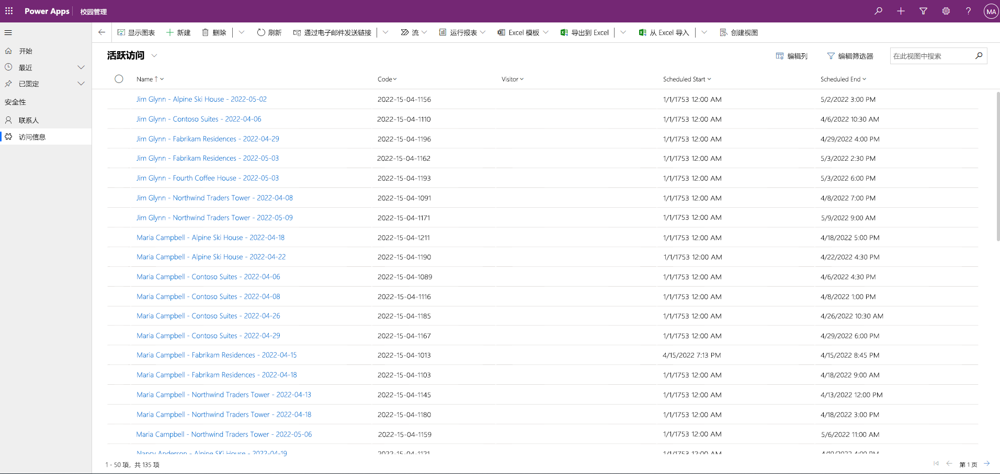

---
lab:
  title: 实验室 3：如何构建模型驱动的应用
  module: 'Module 3: Get started with Power Apps'
---

# 实验室 3：如何构建模型驱动的应用

## 方案

Bellows College is an educational organization with multiple buildings on campus. Campus visitors are currently recorded in paper journals. The information is not captured consistently, and there are no means to collect and analyze data about the visits across the entire campus.

校园管理部门希望对其访客登记系统进行现代化改造。在该系统中，由安全人员控制对建筑物的访问，所有访问都必须由主办人预先登记和记录。

在整个课程中，你将生成应用程序并执行自动化，以使 Bellows College 的管理和安全人员可以管理和控制校园建筑的出入情况。

在本实验室中，你将生成一个 Power Apps 模型驱动应用，以允许后台办公室的校园工作人员管理整个校园的访问记录。

概要实验室步骤

作为创建模型驱动应用的一部分，你将完成以下操作：

- 新建一个名为“校园管理”的模型驱动应用

- 编辑应用导航以引用所需的表

- 自定义应用所需表的表单和视图

我们将使用以下组件：

- **视图**：视图允许用户显示表单表中的现有数据。

- **窗体**：用户在此处创建/更新表中的新记录。

两者都将集成到模型驱动应用中，以提供更好的用户体验。

先决条件

- 完成“模块 0 实验室 0 - 验证实验室环境”
- 完成“模块 2 实验室 1 - 数据建模”

开始前要考虑的事项

- 应该进行哪些更改以改善用户体验？
- 基于我们生成的数据模型，我们应该在模型驱动应用中包括哪些内容？
- 可以在模型驱动应用的网站图上进行哪些自定义？

## 练习 1：自定义视图和表单

**目的：** 在本练习中，你将自定义将在模型驱动应用中使用的自定义创建表的视图和表单。

### 任务 \#1：编辑访问表单

1. 登录到 [https://make.powerapps.com](https://make.powerapps.com/)（如果尚未登录）。

2. 如果尚未选择“[我的初始] 练习”环境，请在右上角选择它。

3. 使用左侧的导航展开 Dataverse，选择“表”，然后单击以打开 Visit 表  。

如果未看到“访问”表，请确保位于正确的环境中（步骤 2）。

4. 在“数据体验”部分下，选择“表单”，然后单击以打开具有“主要”表单类型的信息表单  。

<bpt id="p1">**</bpt>IMPORTANT:<ept id="p1">**</ept> Since by default all forms are named Information, make sure to verify that the form you select has a Form Type of <bpt id="p2">**</bpt>Main<ept id="p2">**</ept> and not something else. By default, the form has two fields: Name and Owner.

5. 在屏幕右侧的“属性”面板中，选择“显示名称”字段，并将其更改为“主要信息” 。

6. 使用屏幕顶部的菜单，通过将列拖动到表单或直接单击列名来选择“+ 表单”字段，然后在“所有者”字段下添加以下字段 ：

    1. **访问者**

    1. **计划开始日期**

    1. **计划结束日期**

    1. **** 实际开始日期

    1. **** 实际结束日期

7. 拖动“代码”列并将其拖到表单页眉处。

The header is the top right area of the form. You may need to collapse the Properties panel on the right side of the screen to see the field on the form.

8. 在“代码”字段仍处于选中状态时，选中屏幕右侧“属性”面板中的“只读字段”复选框 。

9. Select <bpt id="p1">**</bpt>Owner<ept id="p1">**</ept> field. In the Properties panel, change the <bpt id="p1">**</bpt>Label<ept id="p1">**</ept> to <bpt id="p2">**</bpt>Host<ept id="p2">**</ept>

10. 单击右上方的“保存“，然后等待保存完成。

11. 单击右上方的“发布”，并等待发布完成。

12. Bellows College 是一所教育机构，校园内有多座建筑。

13. 当前，校园访客被记录在纸质日记中。

### 任务 \#2：编辑“活跃访问”视图

在此任务中，我们将修改默认的“活动访问”视图并为今天的访问新建视图。

1. 在“数据体验”部分下，选择“视图”，然后单击以打开“活动访问”视图  。

2. 通过单击或拖放字段，将以下字段添加到视图中：

    1. **代码**

    2. **访问者**

    3. **计划开始日期**

    4. **计划结束日期**

3. 无法始终如一地捕获信息，也无法收集和分析有关整个校园的访问数据。

4. 重设各个列的宽度以适应数据。

5. 单击“保存”，然后等待更改保存完毕。

6. 单击“发布”并等待发布完成。

### 任务 3：为今天的访问新建视图

现在我们将克隆视图，来为今天的访问创建一个新视图。

重要提示：请确保你未关闭“活动访问”视图，因为我们将利用它创建新的今天访问视图。

1. 单击“保存”按钮旁的下拉箭头（请注意不是按按钮本身）并选择“另存为”。

2. 将名称更改为“今天的访问”，然后按“保存” 。

3. 单击“属性”面板中的“编辑筛选器”链接。

4. 单击“添加”，选择“添加行”。

5. 选择“计划开始时间”作为字段，然后在下拉菜单中选择“今天”作为条件。

6. Click the <bpt id="p1">**</bpt>…<ept id="p1">**</ept> on the <bpt id="p1">**</bpt>Status<ept id="p1">**</ept> row and click <bpt id="p2">**</bpt>Delete<ept id="p2">**</ept> to delete that filter condition.

7. Press <bpt id="p1">**</bpt>Ok<ept id="p1">**</ept> to save the condition. The view is now filtered to show only records where the Scheduled Start date is today.

8. 在视图中添加“实际开始时间”和“实际结束时间”字段。

<bpt id="p1">**</bpt>Note:<ept id="p1">**</ept> Since we no longer filter on the view status, we will get all today’s visits including completed ones. These fields will help to differentiate completed visits and visits in progress.

1. 单击“ **保存**”。

2. 单击“发布”并等待发布完成。

## 练习 2：创建模型驱动应用

目的：在本练习中，你将创建模型驱动应用、自定义站点地图并测试该应用。

为简单起见和节约时间，我们将不讨论本实验室中的一些访问列。

### 任务 \#1：创建应用

1. 登录到 [https://make.powerapps.com](https://make.powerapps.com/)（如果尚未登录）。

2. 如果尚未选择“[我的初始] 练习”环境，请在右上角选择它。

3.  如有必要，请单击屏幕左侧的“主页”图标。

3. 创建模型驱动应用程序：

    1. 在“主页”屏幕的“开始”部分中选择“空白应用” 。

    1. 在“基于 Dataverse 的空白应用”下，选择“创建” 。

    1. 输入“Bellows 校园管理”作为名称，然后选择“创建” 。

4. 加载新的模型驱动应用程序后，选择“+ 添加页面”按钮。

5. 在“添加页面”屏幕上，选择“基于表的视图和表单”，然后选择“下一步”按钮 。

6. 添加下表：

    1. 访问

    1. 联系人

7. 选择 2 个表后，选择“添加”。

8. 使用屏幕左侧的导航图标，选择“导航”。

9. 在导航窗格中，选择导航栏下方的“组 1”。

10. 在屏幕右侧的“显示选项”部分，将“标题”属性更改为“安全性”  。

### 任务 #2：编辑应用

现在我们已经将所有必要的组件添加到模型驱动应用程序中，现在将组织项。

1. 在“导航”窗格中的安全组下，选择“SubArea1”。

2. 选择省略号，然后从显示的菜单中选择“删除 SubArea1” 。

3. 使用屏幕左侧的导航，选择“页面”。

4. 在“页面”窗格中找到并展开“访问”。

5. 选择“访问表单”。

6. 在屏幕右侧，选择“添加表单”。

7. 选择“主要信息”表单。

8. 在“页面”窗格的“访问”下，选择“访问视图” 。

9. 在屏幕右侧，选择“添加视图”。

10. 选择“今天的访问”视图。

11. 再次选择“添加视图”。 

12. 选择“活动访问”视图。 

13. 选择“保存”。

14. “保存”完成后，选择“发布”按钮发布所做的更改 。

### 任务 3：测试应用程序

1. 启动应用程序

    1. 选择“播放”，在新窗口中打开应用。

2. 新建“Contact”

    1. The app should open to the <bpt id="p1">**</bpt>My Active Contacts<ept id="p1">**</ept> view. If it does not, select Contacts on the left-hand navigation.

    1. 在顶部菜单中单击“新建”。

    1. 在“名字”中输入“John”，在“姓氏”中输入“Doe” 。

    1. Provide your personal email as <bpt id="p1">**</bpt>Email<ept id="p1">**</ept>. This will be used in a future lab where you will receive an email.

    1. 单击“保存并关闭”****。

    1. 现在应该可以在“我的可用联系人”视图中看到已创建的联系人。

3. 新建“Visit”

    1. 从站点地图的左侧导航中，选择“访问”。

    1. 单击“+ 新建”。

    1. 输入以下字段

        1. **名称**：新测试访问

        1. **访客**：选择 John Doe

        1. **计划开始时间**：选择明天的日期和下午 2:00 作为开始时间

        1. **计划结束时间**：选择明天的日期和下午 3:30 作为结束时间

- Click <bpt id="p1">**</bpt>Save &amp; Close<ept id="p1">**</ept>. This will create the Visit and you should be able to see it on the Active Visits View.

- Change view to <bpt id="p1">**</bpt>Today’s Visits<ept id="p1">**</ept>. You should no longer see the new visit in the view, since it is scheduled for tomorrow.

4. 可以添加更多测试记录。

正在运行的应用看上去大致如下图所示：

Congratulations! You have created and configured your first model-driven app.

## 挑战

- 为联系人选择特定的视图和表单