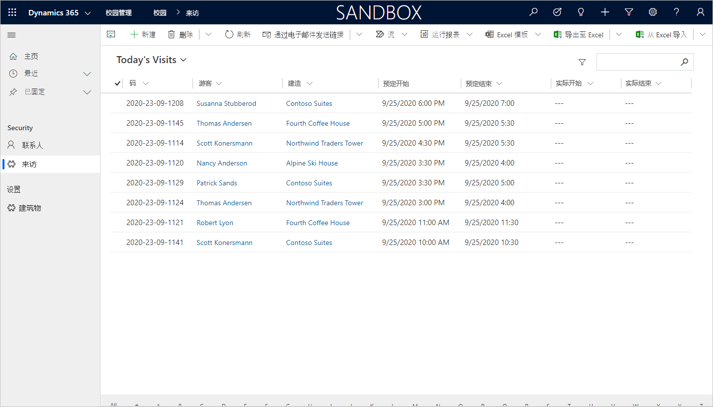

---
lab:
    title: '实验室 4：如何构建模型驱动的应用'
    module: '模块 3：Power Apps 入门'
---

# 模块 3：Power Apps 入门
## 实验室 3：如何构建模型驱动的应用

### 重要通知（2020 年 11 月生效）：
Common Data Service 已重命名为 Microsoft Dataverse。Microsoft Dataverse 中的一些术语已更新。例如，实体（现在是 **“表”**）、字段（现在是 **“列”**）以及记录（现在是 **“行”**）可能已过时。请在执行实验室操作时谨记这一点。我们预期将在不久之后更新全部内容。

有关详细信息以及受影响术语的完整列表，请访问[什么是 Microsoft Dataverse？](https://docs.microsoft.com/zh-cn/powerapps/maker/common-data-service/data-platform-intro#terminology-updates)

# 应用场景

Bellows College 是一所教育机构，校园内有多座建筑。当前，校园访客被记录在纸质日记中。无法始终如一地捕获信息，也无法收集和分析有关整个校园的访问数据。 

校园管理部门希望对其访客登记系统进行现代化改造。在该系统中，由安全人员控制对建筑物的访问，所有访问都必须由主办人预先登记和记录。

在整个课程中，你将生成应用程序并执行自动化，以使 Bellows College 的管理和安全人员可以管理和控制校园建筑的出入情况。 

在本实验室中，你将生成一个 Power Apps 模型驱动应用，以允许后台办公室的校园工作人员管理整个校园的访问记录。

# 概要实验室步骤

作为创建模型驱动应用的一部分，你将完成以下操作：

-   新建一个名为“校园管理”的模型驱动应用

-   编辑应用导航以引用所需的表

-   自定义应用所需表的表单和视图

我们将使用以下组件：

- **视图**：视图允许用户显示表单表中的现有数据。

- **表单**：用户在此处创建/更新表中的新记录。

两者都将集成到模型驱动应用中，以提供更好的用户体验。

## 先决条件

* 完成**模块 0 实验 0 - 验证实验室环境**
* 完成 **“模块 2 实验室 1 - Microsoft Dataverse 简介”**

## 开始前要考虑的事项

-   应该进行哪些更改以改善用户体验？

-   基于我们生成的数据模型，我们应该在模型驱动应用中包括哪些内容？
    
-   可以在模型驱动应用的站点地图上进行哪些自定义？

# 练习 \#1：自定义视图和窗体

**目标：** 在本练习中，你将自定义将在模型驱动应用中使用的自定义创建表的视图和表单。

## 任务 \#1：编辑访问表单

1.  登录到 <https://make.powerapps.com>（若尚未登录）

2.  选择你的 **“环境”。**

3.  选择 **“解决方案”**。

4.  单击打开 **“校园管理”** 解决方案。

5.  单击打开 **“访问”** 实体。

6.  选择 **“表单”** 选项卡，然后单击打开 **“主”** 表单类型。 

    > 默认情况下，该表单具有两个字段：“名称”（主字段）和“所有者”。
    
7.  通过将列拖动到表单或直接单击列名来选择“**+ 表单**”字段，然后在“**所有者**”字段下添加以下字段：

    * **建筑物**
    * **访问者**
    * **计划开始**
    * **计划结束**
    * **实际开始**
    * **实际结束** 
    
8.  拖动 **“代码”** 列并将其拖到表单页眉处。 

    > 标题是表单的右上角区域。你可能需要最小化屏幕右侧的“属性”面板才能看到表单上的字段。

9.  在 **“代码”** 字段仍处于选中状态时，在“属性”面板中选中 **“只读字段”** 复选框。

10.  选择 **“所有者”** 字段。在“属性”面板中将 **“字段标签”** 更改为 **“主机”**

11.  单击右上方的 **“保存“**，然后等待保存完成。

12.  单击右上方的 **“发布”**，并等待发布完成。

13.  单击屏幕左上方的 **“上一步”**。现在，你已经后退到
     访问实体“表单”选项卡。

## 任务 \#2：编辑访问视图

在此任务中，我们将修改默认的“活动访问”视图并为今天的访问新建视图。

1.  选择 **“视图”** 选项卡，然后单击以打开 **“活动访问”** 视图。

2.  通过单击或拖放字段，将以下字段添加到视图中：

    *  **代码**
    *  **访问者**
    *  **建筑物**
    *  **计划开始** 
    *  **计划结束**
    
3.  单击 **“创建时间”** 列并选择 **“删除”**。现在将从视图中删除 **“创建时间”** 字段。

4.  单击 **“名称”** 列并选择 **“删除”**。现在将从视图中删除 **“名称”** 字段。

5.  在右侧的“属性”面板中，单击 **“排序依据 ...”**，然后选择 **“计划开始时间”**。再次单击 **“计划开始时间”**，将排序方式更改为降序。

6.  重设各个列的宽度以适应数据。

7.  单击 **“保存”**，然后等待更改保存完毕。

8.  单击 **“发布”** 并等待发布完成。

现在我们将克隆视图，来为今天的访问创建一个新视图。

9.  按“属性”面板中的 **“编辑筛选器”** 链接。

10.  单击 **“添加”**，选择 **“添加行”**。

11.  选择 **“计划开始时间”** 作为字段，然后在下拉菜单中选择 **“今天”** 作为条件。 

12.  单击 **“状态”** 行上的 **“[...]”**， 然后单击 **“删除”**。 

13.  按 **“确定”** 以保存该条件。视图现已经过筛选，仅显示计划开始日期为今天的记录。

14.  在视图中添加 **“实际开始时间”** 和 **“实际结束时间”** 字段。 

> **备注：** 由于我们不再筛选视图状态，因此我们将获得今天所有的访问，包括已完成的访问。这些字段有助于区分完成的访问和进行中的访问。

15.  单击 **“保存”** 按钮旁的下拉箭头（请注意不是按按钮本身）并选择 **“另存为”**。

16.  将名称更改为 **“今天的访问”**，然后按 **“保存”**。

17.  单击 **“发布”** 并等待发布完成。

# 练习 \#2：创建模型驱动应用程序

**目标：** 在本练习中，你将创建模型驱动应用、自定义站点地图并测试该应用。

> 在生成应用程序时，特别是在自定义站点地图步骤中，你会看到一些未解决的字段。为了进行实验室研究，我们采取了一些捷径。在具体实现时，应为这些项目指定逻辑名称。

## 任务 \#1：创建应用程序

1.  如果尚未打开“校园管理”解决方案，请打开该解决方案。

    -   登录至 <https://make.powerapps.com>

    -   在你的环境中，单击以打开 **“校园管理”**
        解决方案。
    
2.  创建模型驱动应用程序

    -   单击 **“新建”**，选择 **“应用”**，再选择 **“模型驱动应用”**。这将打开一个新选项卡。
    
    -   为“名称”输入 **“[你的姓氏] 校园管理”**。

    -   选择 **“使用现有解决方案创建应用”** 复选框

    -   选择 **“下一步”**

    -   选择 **“校园管理”** 解决方案
    
    -   单击 **“完成”**
    
3.  单击 **“站点地图”** 旁边的铅笔图标。

4.  编辑默认标题

    -   选择 **“新建区域”**。

    -   在右侧的属性窗格中将新区域的标题更改为 **“校园”**。

    -   选择 **“新建组”**。

    -   在右侧的属性窗格中将新组的标题更改为 **“安全”**。
    
5.  将 Contact 表添加到网站图

    -   选择 **“新建子区域”**。

    -   在 **“属性”** 窗格，从下拉列表中选择 **“实体”**
        （针对 **“类型”**）。

    -   在下拉列表的 **“实体”** 中搜索 **“Contact”** 表。
    
6.  将 Visit 表添加到网站图

    -   选择 **“安全性”** 组，然后单击 **“添加”**。

    -   选择 **“子区域”**。

    -   转至 **“属性”** 窗格。

    -   从 **“类型”** 的下拉列表中选择 **“实体”**，然后搜索
        从下拉列表的 **“实体”** 中搜索 **“Visit”** 表。
    
7.  将 Building 表添加到网站图

    -   选择 **“校园”** 区域，然后单击 **“添加”**。
    
    -   选择 **“组”**。
    
    -   在 **“属性”** 窗格的 **“标题”** 中，输入 **“设置”**。
    
    -   在仍选中“**设置**”组的情况下，单击“**添加**”。
    
    -   选择 **“子区域”**。
    
    -   转至 **“属性”** 窗格。
    
    -   从 **“类型”** 下拉列表中选择 **“实体”**，并从 **“实体”** 下拉列表中搜索 **“Building”** 表。

8.  单击 **“保存”**。保存更改时，将显示加载屏幕。

9.  单击 **“发布”** 以发布站点地图，并等待发布完成。

10.  单击 **“保存并关闭”** 以关闭站点地图编辑器。 

    > 你将看到添加到站点地图的实体的资产现在位于应用程序中。
     
11.  在“应用设计器”中，单击 **“保存”**。

12.  单击 **“验证”** 以验证在应用程序中所做的更改。 

>  这将显示一些警告，但我们可以忽略这些警告，因为我们还没有为实体引用特定的视图和表单，且用户将可以访问 **“访问”** 和 **“建筑物”** 实体的所有视图和表单。
     
13. 单击 **“发布”**

14.  单击 **“保存并关闭”** 以关闭应用设计器。

15.  单击 **“完成”**。

16.  选择 **“解决方案”**，然后选择 **“发布所有自定义项”**。

17.  选择 **“应用”**，此时应列出你的应用程序。

## 任务 \#2：测试应用程序

1.  启动应用程序

    -   选择 **“应用”** 并单击 **“校园管理”** 应用。（如果一开始没有看到你的应用，则可能需要刷新浏览器。）

    -   应用程序会在新窗口中打开。
    
2.  新建 “Contact”

    -   应用会打开 **“可用联系人”** 视图

    -   在顶部菜单中单击 **“新建”**。

    -   在 **“名字”** 中输入 `John`，并在 **“姓氏”** 中输入 `Doe`。

    -   在 **“电子邮件”** 中输入你的个人电子邮件。这将用在以后的某个实验室中。 
    
    -   单击 **“保存并关闭”**。

    -   现在应该可以在 **“可用联系人”** 视图中看到创建的联系人。
    
3.  新建 “Building”

    -   从网站图中选择 **“建筑物”**。

    -   单击 **“新建”**。

    -   在 **“名称”** 中输入 `Microsoft Building`
        
    -   单击 **“保存并关闭”**。这将在
        “可用建筑物”视图中显示新创建的记录。
    
4.  新建 “Visit”

    -   从网站图中选择 **“访问”**。
    
    -   单击 **“新建”**。
    
    -   输入以下字段 
    
        -   **名称**：`New test visit`
        -   **建筑物**：选择 Microsoft Building
        -   **访客**：选择 John Doe
        -   **计划开始时间**：选择明天的日期和下午 2:00 作为开始时间
        -   **计划结束时间**：选择明天的日期和下午 3:30 作为结束时间
        
    -   单击 **“保存并关闭”**。这将创建 Visit，并且你应该可以在
        “活动访问”视图中看到它。
        
    -   将视图更改为 **“今天的访问”**。由于新访问安排在明天，因此视图中不再显示该访问。
    
5. 可以添加更多测试记录。

   正在运行的应用看上去大致如下图所示：

# 挑战

* 为参观和建筑物选择特定的视图和表单
* 安全人员通常在单个建筑物中工作。你如何为他们提供一种简单的方法，使他们仅显示所选建筑物的访问量？
* 限制对特定实体的访问，例如，除管理员外，建筑物对所有员工都应是只读的
* 你会考虑将哪些仪表板添加到应用？
