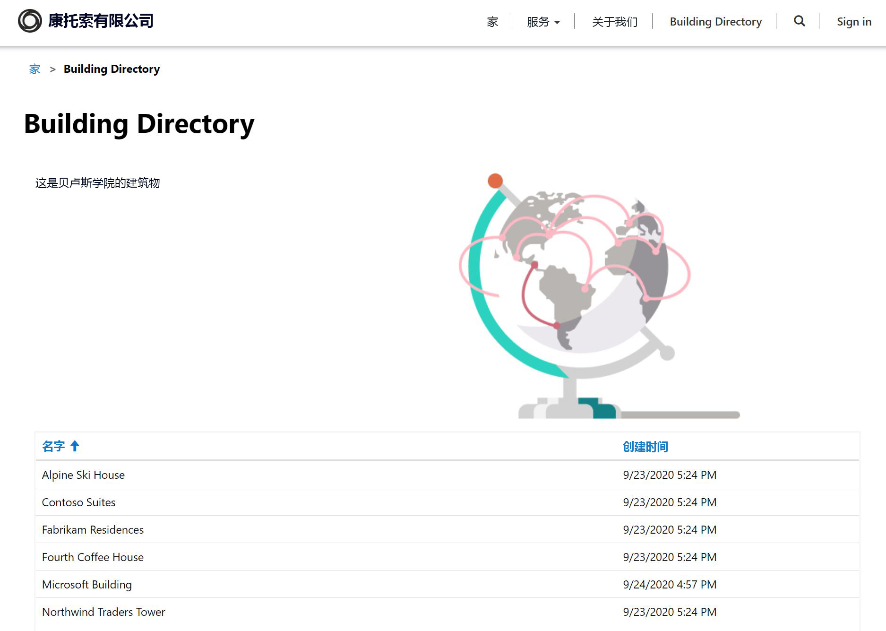

---
lab:
  title: 实验室 5：如何构建 Power Apps 门户
  module: 'Module 3: Get started with Power Apps'
ms.openlocfilehash: 3bbeaad63ccd84285b5471894b8377918433f383
ms.sourcegitcommit: ef58c858463b890e923ef808b1d43405423943fd
ms.translationtype: HT
ms.contentlocale: zh-CN
ms.lasthandoff: 01/27/2022
ms.locfileid: "137898842"
---
# <a name="module-3-get-started-with-power-apps"></a>模块 3：Power Apps 入门

## <a name="lab-4-how-to-build-a-power-apps-portal"></a>实验室 4：如何构建 Power Apps 门户

# <a name="scenario"></a>方案

Bellows College 是一所教育机构，校园内有多座建筑。 目前，校园访问记录在纸质日报上。 无法始终如一地捕获信息，也无法收集和分析有关整个校园的访问数据。

校园管理部门希望向访问者提供有关校园建筑物的信息。 访问者将能够在网站上查看建筑物列表，该网站将使用 Power Apps 门户进行构建。

在本实验室中，你将预配 Power Apps 门户并创建一个门户网页，该网页将显示校园中的建筑物列表。

# <a name="high-level-lab-steps"></a>概要实验室步骤

将按照以下大纲设计 Power Apps 门户：

* 在 Dataverse 环境中预配 Power Apps 门户
* 创建并配置网页以显示建筑物列表
* 新建主题并将其应用于门户

## <a name="prerequisites"></a>先决条件

* 完成“模块 0 实验室 0 - 验证实验室环境”
* 完成“模块 2 实验室 1 - Microsoft Dataverse 简介”

## <a name="things-to-consider-before-you-begin"></a>开始前要考虑的事项

* Power Apps 门户应用总是始于模板，而非空白应用程序。 你的门户应该已经在模块 0 实验室 0 中创建。 预配门户后，它就已具备页面、菜单和默认主题。 

# <a name="exercise-1-create-a-portal-webpage"></a>练习 \#1：创建门户网页

**目的：** 在本练习中，你将创建一个新的网页，其中将显示一些静态内容以及 Dataverse 中的建筑物列表。

## <a name="task-1-navigate-to-portal"></a>任务 \#1：导航到门户

1.  导航到 <https://make.powerapps.com>。

2.  验证自己是否处于练习环境中。 如果不是，请更改右上角的环境。

3.  单击“应用”

4.  找到“类型”为“门户” 的应用

5.  单击应用名称以打开门户

    > 系统会将你重定向到带有欢迎消息的门户网站登陆页面 浏览门户，查看在预配门户时默认创建的内容。 

## <a name="task-2-create-a-webpage"></a>任务 \#2：创建网页

1.  打开 Power Apps 门户 Studio

    -   登录到 <https://make.powerapps.com>（你可能仍在标签页中打开着此页面）

    -   选择“应用”
    
    -   找到“类型”为“门户” 的应用

    -   单击门户应用名称右侧的省略号 (...)，然后选择“编辑” 

    > 你现在位于 Power Apps 门户 Studio 中。 你可以在此处修改和创建门户内容。

2.  创建新页面

    -   在命令栏上，选择“新建页面”

    - 选择“登陆页面”

3.  在属性窗格的“显示”下，将“名称”从“新页面(1)”更改为 `Building Directory`  

4.  在“部分 URL”中，将值更改为 `building-directory`，按 Tab 键（启动自动保存）

    > 页面标题现在应显示为“建筑物目录”
    
## <a name="task-3-add-static-content"></a>任务 \#3：添加静态内容

1.  向网页添加一节

    - 在画布（显示网页的区域）上，选择页面中不是列的部分。

    -   在工具带（左侧）上，选择“组件”图标

    -   从“节布局”区域选择“两列节”

2.  添加静态文本

    -   在画布（显示网页的区域）上选择左列

    -   在工具带（左侧）上，选择“组件”图标

    -   从“门户组件”选择“文本”

    -   在新的文本区域中，输入以下文本：
          ```
          The following is the building directory.
          ```
    -   选择刚编辑的文本上方的文本框，然后单击命令栏上的“删除”以删除默认文本。

3. Add an Image

    -   在画布（显示网页的区域）上选择右列

    -   在工具带（左侧）上，选择“组件”图标

    -   从“门户组件”区域选择“图片”

    - 在属性窗格中，单击“选择图片”。 找到并选择 Pages.png
    
    -   在属性窗格中，单击“格式设置”部分下拉列表，然后将“宽度”更改为 70%（请务必键入 %）。 你可以尝试调整图片的大小，直到达到所需的大小为止。

4.  配置权限以显示建筑物列表 

    -   从左侧菜单中，单击“设置”（齿轮符号）并选择“查看更多设置”。 这会在新选项卡中打开其他设置。

    -   在左侧菜单中，向下滚动到“安全性”，然后选择“表权限”。 

    -   单击“新建”并添加以下值：

        -   **名称**：显示建筑物列表
        -   **表名**：从右侧的下拉列表中选择“建筑物(bc_building)”
        -   网站：单击“放大镜”并选择你的网站（Bellows College 访客 - [你的命名]）
        -   访问类型：全球
        -   特权：读取
    
    -   从顶部菜单中，选择“保存”。
    
    -   向下滚动到“Web 角色”部分，然后选择“添加现有 Web 角色”。
    
    -   单击放大镜，选择“匿名用户”，然后单击“添加”。
    
    -   从顶部菜单中，选择“保存并关闭”。
    
    -   回到上一个选项卡。

5.  单击“浏览网站”查看到目前为止的页面。  请注意，主菜单上现在出现了“Building Directory”选项。

    > 你可能需要将浏览器配置为允许弹出窗口。

## <a name="task-4-add-a-list-component"></a>任务 \#4：添加列表组件

1.  导航到上一个选项卡，然后继续执行步骤 #2。 如果不可用，请按照以下步骤返回到该位置。

    -   登录到 <https://make.powerapps.com>（你可能仍在标签页中打开着此页面）

    -   找到“类型”为“门户” 的应用

    -   单击省略号 (...) 并选择“编辑” 
    
    -   在工具带（左侧）上，选择“页面”选项 

    -   找到并选择你先前创建的“建筑物目录”页面
    
2.  向“Building Directory”页面添加列表组件

    -   选择具有两个列的部分。

    -   在工具带（左侧）上，选择“组件”图标

    -   从“节布局”区域选择“一列节”（网页上图片和文字下方会出现一个部分）

    -   在画布上选择新的列节

    -   在工具带（左侧）上，选择“组件”图标

    -   从“门户组件”区域选择“列表”（列表组件将出现在新节中）
    
3.  配置列表组件

    -   选择画布上的列表组件

    -   在属性窗格（右侧）中，在“名称”字段中输入 `Buildings List`

    -   在“表”字段中，从下拉列表中选择“建筑物(bc_building)”

    -   在“视图”中，选择“可用建筑物”

    -   保留其余的默认设置
    
4.  单击“浏览网站”以查看页面。 

    > 你应会看到 Dataverse 数据库中的建筑物列表出现在网页上。

# <a name="exercise-2-change-the-portal-theme"></a>练习 \#2：更改门户主题

**目的：** 在本练习中，你将创建一个新主题，该主题将更改门户的配色方案。 

## <a name="task-1-apply-and-edit-a-theme"></a>任务 #1：应用和编辑主题

1.  导航到上一个选项卡，然后继续执行步骤 #2。 如果不可用，请按照以下步骤返回到该位置。

    -   登录到 <https://make.powerapps.com>（你可能仍在标签页中打开着此页面）

    -   找到“类型”为“门户” 的应用

    -   单击省略号 (...) 并选择“编辑” 
    
2.  应用并自定义基本主题

    -   在工具带（左侧）上，选择主题图标
    
    - 确保将“启用基本主题”的切换按钮设置为“开”。
    
    -   在其中一个预设上，单击省略号 (...) 并选择“自定义” 
    
    -   基本主题的副本已创建。 
    
    -   在属性窗格上，尝试更改颜色并探索这些更改对门户的影响。
    
    -   重命名主题。
    
3.  在命令栏上，单击“同步配置”。

你的应用布局应类似于以下结构：



# <a name="challenges"></a>挑战

* 创建一个不同的仅显示建筑物名称的建筑物视图。 你将需要在门户 Studio 中选择“浏览网站”以查看更改。
* 在工具带上，单击“主题”图标，然后编辑自定义主题的 CSS。
* 使用“表单”组件创建一个页面，并修改“列表”组件以使用该表单添加或编辑 Dataverse 行。
* 在“列表”组件“设置”中中启用“实体权限”，数据有何变化？
* 在门户 Studio 中，选择“源代码编辑器”图标 `</>` 查看页面源。 如果你熟悉 HTML，请进行一些修改并查看结果。
