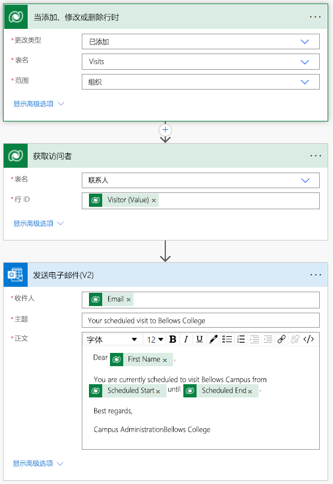

---
lab:
  title: 实验室 4：如何构建自动解决方案
  module: 'Module 4: Get Started with Power Automate'
---

# 实验室 4：如何构建自动解决方案

## 方案

Bellows College is an educational organization with multiple buildings on campus. Campus visitors are currently recorded in paper journals. The information is not captured consistently, and there are no means to collect and analyze data about the visits across the entire campus.

校园管理部门希望对其访客登记系统进行现代化改造。在该系统中，由安全人员控制对建筑物的访问，所有访问都必须由主办人预先登记和记录。

在整个课程中，你将生成应用程序并执行自动化，以使 Bellows College 的管理和安全人员可以管理和控制校园建筑的出入情况。

在此实验室中，你将创建一个 Power Automate 流，以在计划访问时向访客发送电子邮件。

## 概要实验室步骤

以下已被确定为完成项目必须满足的要求：

- 计划访问时，需要通过电子邮件通知联系人。

## 先决条件

- 完成“模块 0 实验室 0 - 验证实验室环境”
- 完成“模块 2 实验室 1 - 数据建模”
- 完成“模块 2 实验室 3 - 如何生成模型驱动应用”
- 创建了 John Doe 联系人并填充了个人电子邮件地址

## 练习 1：创建访问通知流

<bpt id="p1">**</bpt>Objective:<ept id="p1">**</ept> In this exercise, you will create a Power Automate flow that implements the requirement. The visitor should be sent an email that includes the unique code assigned to the visit when a visit is created.

### 任务 \#1：创建流

1.  Navigate to <ph id="ph1">&lt;https://make.powerapps.com&gt;</ph>. You may need to reauthenticate - click <bpt id="p1">**</bpt>Sign in<ept id="p1">**</ept> and follow instructions if needed.

2.  如果尚未选择“[我的初始] 练习”环境，请在右上角选择它。

3.  在左侧导航栏中，选择“流”。

4.  如果出现提示，请选择“开始”。

5.  单击“新建流”，然后选择“自动化的云端流” 。

6.  为“流名称”输入“访问通知”。

7.  在“选择流的触发器”中，搜索 Dataverse 。

8.  选择触发器“添加、修改或删除行时”，然后单击“创建”。

9.  填充流的触发条件：

    1.  为“更改类型”选择“已添加”

    2.  为“表名称”选择“Visits” 

    3.  为“范围”选择“组织” 

    4.  On the trigger step, click the ellipsis (<bpt id="p1">**</bpt>...<ept id="p1">**</ept>) and click <bpt id="p2">**</bpt>Rename<ept id="p2">**</ept>. Rename this trigger <bpt id="p1">**</bpt>"When a visit is added"<ept id="p1">**</ept>. This is a good practice, so you and other flow editors can understand the purpose of the step without having to dive into the details.

### 任务 \#2：创建用于获取访客行的步骤

1.  Bellows College 是一所教育机构，校园内有多座建筑。

2.  搜索“Dataverse”。

3.  选择“按 ID 获取行”操作。

4.  选择“Contacts”作为“表名称”

5.  当前，校园访客被记录在纸质日记中。

6.  无法始终如一地捕获信息，也无法收集和分析有关整个校园的访问数据。

7.  On this action, click the ellipsis (<bpt id="p1">**</bpt>...<ept id="p1">**</ept>) and click <bpt id="p2">**</bpt>Rename<ept id="p2">**</ept>.
        Rename this action <bpt id="p1">**</bpt>"Get the Visitor"<ept id="p1">**</ept>. This is a good practice, so you and other flow editors can understand the purpose of the step without having to dive into the details.

### 任务 \#3：创建用于向访客发送电子邮件的步骤

1.  Click <bpt id="p1">**</bpt>+ New step<ept id="p1">**</ept>. This is the step that will send an email to the visitor.

2.  搜索“邮件”，选择“Office 365 Outlook”连接器和“发送电子邮件 (V2)”操作 。

3.  如果要求接受使用此操作的条款和条件，请单击“接受”。

4.  在“收件人”字段下选择“添加动态内容” 。 
    
5.  从动态内容列表中选择“电子邮件”。
        > Notice that it is beneath the **Get the visitor** header. This means you
        are selecting the Email that is related to the Visitor that you looked
        up in the previous step.

6.  在“主题”字段中输入“你对 Bellows College 的计划访问”。

7.  在“电子邮件正文”中输入以下文本：

>   Dynamic content needs to be placed where fields are named in brackets. It is recommended to copy &amp; paste all text first and then add dynamic content in the correct places.

~~~~~~~~~~~~~~~~~~~~~~~~~~~~~~~~~~~~~~~~~~~~~~~~~~~~~~~~~~~~~~~~~~~~~~~~~~~~~~~~
   Dear {First Name},

   You are currently scheduled to visit Bellows Campus from {Scheduled Start} until {Scheduled End}.

   Best regards,

   Campus Administration
   Bellows College
~~~~~~~~~~~~~~~~~~~~~~~~~~~~~~~~~~~~~~~~~~~~~~~~~~~~~~~~~~~~~~~~~~~~~~~~~~~~~~~~

8.  Highlight the <bpt id="p1">**</bpt>{First Name}<ept id="p1">**</ept> text. Replace it with the <bpt id="p1">**</bpt>First Name<ept id="p1">**</ept> field from the <bpt id="p2">**</bpt>Get the Visitor<ept id="p2">**</ept> step.

9.  Highlight the <bpt id="p1">**</bpt>{Scheduled Start}<ept id="p1">**</ept> text. Replace it with the <bpt id="p1">**</bpt>Scheduled Start<ept id="p1">**</ept> field <bpt id="p2">**</bpt>When a visit is added<ept id="p2">**</ept> step.

10.  Highlight the <bpt id="p1">**</bpt>{Scheduled End}<ept id="p1">**</ept> text. Replace it with the <bpt id="p1">**</bpt>Scheduled End<ept id="p1">**</ept> field from the <bpt id="p2">**</bpt>When a visit is added<ept id="p2">**</ept> step.

11.  单击“ **保存**”。

Leave this flow tab open for the next task. You flow should look approximately like the following:

### 任务 \#4：验证并测试流

1.  在浏览器中打开新选项卡并导航到 <https://make.powerapps.com>。

2.  如果尚未选择“[我的初始] 练习”环境，请在右上角选择它。

3.  单击“应用”，然后选择之前创建的 Bellows 校园管理模型驱动应用 。

3.  保持此浏览器标签页处于打开状态，然后导航回到流的上一个选项卡。

4.  On the command bar, click <bpt id="p1">**</bpt>Test<ept id="p1">**</ept>. Select <bpt id="p1">**</bpt>Manually<ept id="p1">**</ept> and then click <bpt id="p2">**</bpt>Test<ept id="p2">**</ept>.

5.  导航到打开了模型驱动应用的浏览器标签页。 

6.  使用左侧导航栏，选择“访问”

6. 按“+ 新建”按钮添加新的“访问”记录 。

7. 完成访问记录，如下所示：

    -   **名称：** 测试访问

    -   **访客：** John Doe

    -   **计划开始时间：** 明天上午 8:00

    -   **计划结束时间：** 明天上午 9:00

8. 选择“保存并关闭”按钮。

9. Navigate to the browser tab with your flow test running. After a short delay, you should see the flow running. This is where you can catch any issues in the flow or confirm that it ran successfully.

After a short delay, you should see an email in your inbox, since you populated John Doe's email as your personal email. Note that it may go to your Junk Email folder.

## 挑战

- Play around with the formatting on the email. How can you make it more professional looking?