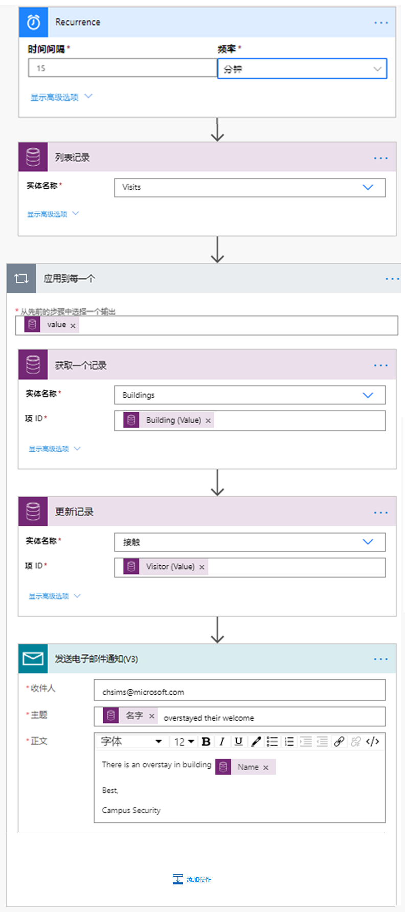

---
lab:
  title: 实验室 6：如何构建自动解决方案
  module: 'Module 4: Get Started with Power Automate'
ms.openlocfilehash: 9b26af0345e67d338409a3712fd77e581721ab29
ms.sourcegitcommit: ef58c858463b890e923ef808b1d43405423943fd
ms.translationtype: HT
ms.contentlocale: zh-CN
ms.lasthandoff: 01/27/2022
ms.locfileid: "137898877"
---
# <a name="module-4-get-started-with-power-automate"></a>模块 4：Power Automate 入门
## <a name="lab-how-to-build-an-automated-solution"></a>实验室：如何构建自动解决方案

## <a name="scenario"></a>方案

Bellows College 是一所教育机构，校园内有多座建筑。 当前，校园访客被记录在纸质日记中。 无法始终如一地捕获信息，也无法收集和分析有关整个校园的访问数据。 

校园管理部门希望对其访客登记系统进行现代化改造。在该系统中，由安全人员控制对建筑物的访问，所有访问都必须由主办人预先登记和记录。

在整个课程中，你将生成应用程序并执行自动化，以使 Bellows College 的管理和安全人员可以管理和控制校园建筑的出入情况。 

在本实验室中，你将创建 Power Automate 流以自动化校园管理的各个部分。 

# <a name="high-level-lab-steps"></a>概要实验室步骤

以下已被确定为完成项目必须满足的要求：

* 分配给每个访客的唯一代码必须在他们访问之前提供给他们。
* 安全人员需要接收访客超时停留的通知。

## <a name="prerequisites"></a>先决条件

* 完成“模块 0 实验室 0 - 验证实验室环境”
* 完成“模块 2 实验室 1 - Microsoft Dataverse 简介”
* 在“模块 3 实验室 2 - 如何生成画布应用，第 2 部分”中创建的 Campus Staff 应用（用于测试）
* 在“模块 3 实验室 4 - 如何构建模型驱动的应用”中使用个人电子邮件地址创建的联系人 John Doe（用于测试）

## <a name="things-to-consider-before-you-begin"></a>开始前要考虑的事项

-   访客代码的最合适分发机制是什么？
-   如何衡量过久停留并执行严格的策略？

# <a name="exercise-1-create-visit-notification-flow"></a>练习 \#1：创建访问通知流

**目的：** 在本练习中，你将创建一个实现要求的 Power Automate 流。 应向访客发送一封电子邮件，其中包含分配给访问的唯一代码。

## <a name="task-1-create-flow"></a>任务 \#1：创建流

1.  打开校园管理解决方案。

    -   登录到 <https://make.powerapps.com>

    -   选择你的“环境”。

    -   选择“解决方案”。

    -   单击打开“校园管理”解决方案。

2.  单击“新建”，依次选择“自动”、“云流”和“自动化”   。 这将在新窗口中打开 Power Automate 流编辑器。

3. 在“选择流的触发器”中，搜索“Microsoft Dataverse” 。

4. 选择触发器“添加、修改或删除行时”，然后单击“创建”。

   * 为“更改类型”选择“已添加”
   
   * 为“表名称”选择“Visits” 
   
   * 为“范围”选择“组织” 
   
   * 在触发步骤上，单击省略号 (…)，然后单击“重命名” 。 将此触发器重命名为“添加访问时”。 这是一个很好的习惯，这样你和其他流编辑可以理解步骤的目的，而不必深入研究细节。

5. 选择“新建步骤”。 必须执行此步骤来检索访客信息，包括电子邮件地址。

6. 搜索“Microsoft Dataverse”。

7. 选择“按 ID 获取行”操作。 

   * 选择“Contacts”作为“表名称”
   
   * 在“行 ID”字段中，选择动态内容列表中的“访客(值)”。
   
   * 在此操作上，单击省略号 (...)，然后单击“重命名” 。 将此操作重命名为“获取访客”。 这是一个很好的习惯，这样你和其他流编辑可以理解步骤的目的，而不必深入研究细节。

8. 单击“新建步骤”。 这是创建并向访客发送电子邮件的步骤。

9. 搜索“邮件”，选择“Office 365 Outlook”连接器和“发送电子邮件 (V2)”操作 。

   * 如果要求接受使用此操作的条款和条件，请单击“接受”。
   
   * 从动态内容列表中选择“收件人”字段，然后选择“电子邮件”。 请注意，它位于“获取访客”标题下面。 这意味着你正在选择与上一步中查找的访客相关的电子邮件。 

   * 在“主题”字段中输入“你对 Bellows College 的计划访问”。

   * 在“电子邮件正文”中输入以下文本：  
        
        > 需将动态内容置于方括号中命名字段的位置。 建议先复制并粘贴所有文本，然后在正确的位置添加动态内容。
   
        ```
        Dear {First Name},

        You are currently scheduled to visit Bellows Campus from {Scheduled Start} until {Scheduled End}.

        Your security code is {Code}, please do not share it. You will be required to produce this code during your visit.

        Best regards,

        Campus Administration
        Bellows College
        ```
   
10.  选择顶部的“无标题”流名称，并将其重命名为 `Visit notification`

11. 按“保存”

    将此流选项卡保持打开状态以用于下一个任务。 流大致如下所示：


## <a name="task-2-validate-and-test-the-flow"></a>任务 \#2：验证并测试流

1.  在浏览器中打开新的标签页，然后导航到 <https://make.powerapps.com>

2.  单击“应用”，然后选择你创建的“Campus Staff”应用

3.  保持此选项卡处于打开状态，然后导航回到上一个流选项卡。 

4.  在命令栏上，单击“测试”。 选择“手动”，然后选择“保存并测试”。

5.  保持流选项卡处于打开状态，然后使用 Campus Staff 应用导航回上一个选项卡。

6.  按 + 添加新的访问记录

7.  输入“John Doe”作为“姓名”，并选择任意“建筑物”

8.  选择“John Doe”作为“访客”

9.  选择“计划开始日期”和“计划结束日期”到将来的任何日期。

10.  按下复选标记图标以保存新访问

11.  导航回到上一个正在测试的流所在的选项卡。 观察流运行情况。 如果出现任何错误，请返回并将你的流与以上示例进行比较。 如果电子邮件发送成功，你将在收件箱中收到它。 

12.  单击命令栏上的后退箭头

13.  在“详细信息”部分，请注意，“状态”将设置为“开启”。 这意味着你的流将在每次新建访问时运行，直到你将其关闭。 只要流运行，它会出现在“28 天运行历史记录”列表中。

14.  单击命令栏上的“关闭”关闭流。 你可能需要按省略号 (...) 才能查看此选项。

15.  关闭该窗口。

# <a name="exercise-2-create-security-sweep-flow"></a>练习 2：创建安全扫描流

**目的：** 在本练习中，你将创建一个实现要求的 Power Automate 流。 每 15 分钟执行一次安全扫描，如果有访客逗留超时，则会通知保安。

## <a name="task-1-create-flow-to-retrieve-records"></a>任务 #1：创建流以检索记录

1. 打开校园管理解决方案。

   -   登录到 <https://make.powerapps.com>

   -   选择你的“环境”。

   -   选择“解决方案”。

   -   单击打开“校园管理”解决方案。

2. 单击“新建”，依次选择“自动”、“云流”和“计划”   。 这将在新窗口中打开 Power Automate 流编辑器。

3. 将流设置为每 15 分钟重复一次。

4. 单击“创建”。

5. 单击“新建步骤”。 搜索“当前”，然后选择 Microsoft Dataverse 连接器。 选择“列出行”操作。

   * 输入“Visits”作为表名称
   
   * 单击“显示高级选项”

   * 输入以下表达式作为“筛选行”

   ```
     statecode eq 0 and bc_actualstart ne null and bc_actualend eq null and Microsoft.Dynamics.CRM.OlderThanXMinutes(PropertyName='bc_scheduledend',PropertyValue=15)
   ```
   
   * 要进行细分：
       * “statecode eq 0”筛选活动访问（其中“状态”为“活动”）
       * “bc_actualstart ne null”将搜索限制为“实际开始时间”存在值的访问，即存在签入
       * “bc_actualend eq null”将搜索限制在没有签出的访问（“实际结束时间”没有值） 
       * “Microsoft.Dynamics.CRM.OlderThanXMinutes (PropertyName='bc_scheduledend',PropertyValue=15)”限制访问要在 15 分钟前完成。

   * 在此操作上，单击省略号 (...)，然后单击“重命名” 。 重命名此操作“列出结束超过 15 分钟的活动访问”。 这是一个很好的习惯，这样你和其他流编辑可以理解步骤的目的，而不必深入研究细节。

6.  单击“新建步骤”。 搜索“应用”， 选择“应用到每一个”操作 

7.  从“从先前的步骤中选择一个输出”字段的动态内容中选择“值”。 请注意，它位于“列出结束超过 15 分钟的活动访问”灰色标题下方。 这意味着你选择的是在上一步中查找的访问列表。 

8.  检索建筑物数据以获取相关记录

    * 在“应用到每一个”循环内单击“添加操作”。
    
    * 选择“Microsoft Dataverse”。 
    
    * 选择“按 ID 获取行”操作。
    
    * 选择“Buildings”作为“表名称” 
    
    * 从动态内容中选择“建筑物(值)”作为“行 ID” 
    
    * 单击“获取记录”旁边的“...”，选择“重命名”  。 输入“获取建筑物”作为步骤名称
    
9.  检索访客数据以获取相关记录

    * 在“应用到每一个”循环内单击“添加操作”。
    
    * 选择“Microsoft Dataverse”。
    
    * 选择“按 ID 获取行”操作。
    
    * 选择“Contacts”作为“表名称”
    
    * 从动态内容中选择“访客(值)”作为“行 ID” 
    
    * 单击“获取记录”旁边的“...”，选择“重命名”  。 输入“获取访客”作为步骤名称
    
10.  发送电子邮件通知

     * 在“应用到每一个”循环内单击“添加操作”。 从“Office 365 Outlook”连接添加“发送电子邮件 (V2)”操作 。

11.  在“收件人”部分输入你的电子邮件地址

12.  在“主题”字段中输入以下内容。 “全名”是来自“获取访客”步骤的动态内容。

   ```
   {Full Name} overstayed their welcome
   ```
   
13.  在“正文”字段中输入以下内容。 “名称”是来自“获取建筑物”步骤的动态内容。 可能需要滚动到列表底部。

   ```
   There is an overstay in building {Name}.
         
   Best,
         
   Campus Security
   ```

14.  选择左上角的流名称“无标题”，并将其重命名为“安全扫描”

15.  按“保存”

    流看起来应大致如下：



## <a name="task-2-validate-and-test-the-flow"></a>任务 #2：验证并测试流

如果访问符合你的流中列出的要求，该流将开始向你发送电子邮件（发送到你先前创建 John Doe 联系人时指定的电子邮件）。

1. 验证你是否具有以下访问记录：

   1. 具有活动状态
   
   2. 预定结束时间是过去的时间（超过 15 分钟）
   
   3. “实际开始时间”有一个值。
   
   > **注意**：要查看此数据，请在新选项卡中导航到 make.powerapps.com。单击左窗格上的“解决方案”，找到你的解决方案。 选择“访问”实体，然后选择“数据”选项卡。单击右上角的“有效访问”以显示视图选择器，然后选择“全部”字段。
   
2. 导航到“安全扫描”流（如果尚不存在）。

3. 当流打开时，单击“测试”。

4. 选择“手动”。

5. 单击“保存并测试”和“运行流”。

6. 当流完成时，单击“完成”。 

7. 展开“应用到每一个”，然后展开“发送电子邮件通知”步骤。 检查“主题”和“电子邮件正文”的值。

8. 选择返回箭头以查看“安全扫描”流的详细信息。 选择命令栏上的“关闭”。 这是为了防止流按计划在测试系统上执行。

# <a name="challenges"></a>挑战

* 将“实际开始”和“计划结束”添加到电子邮件正文。
* 如何确保电子邮件正文中使用了用户友好的日期格式？
* 是否可以生成一个包含逾期信息的表格，并且只发送一封电子邮件？
* 你可以为访问代码生成条形码吗？ 什么时候有用？
