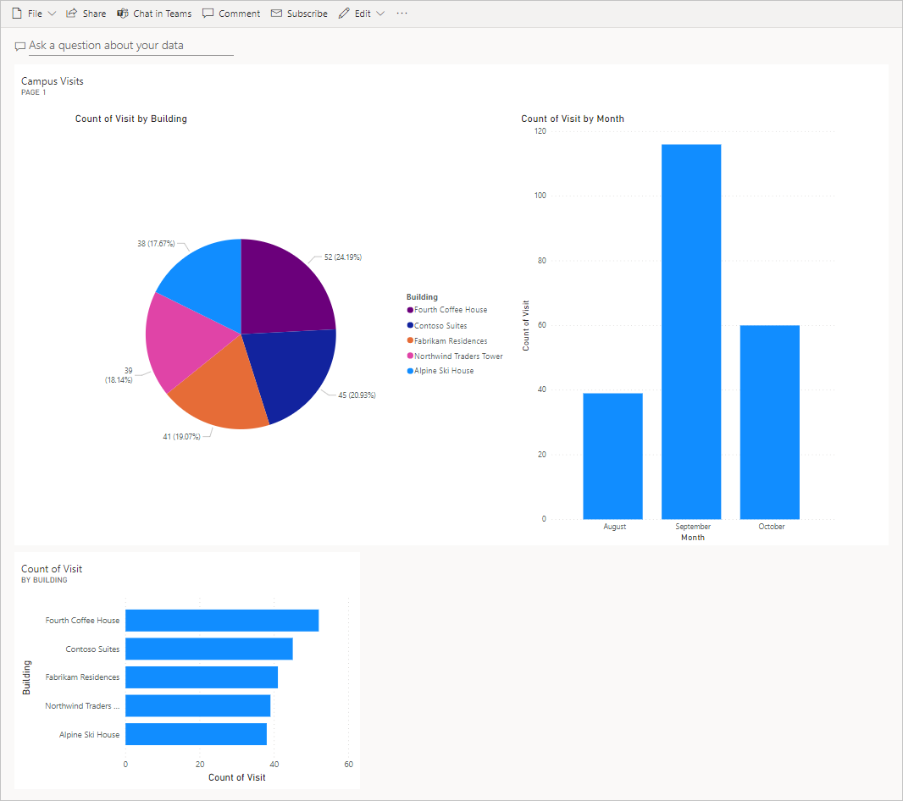

---
lab:
  title: 实验室 5：如何生成简单仪表板
  module: 'Module 5: Describe the capabilities of Microsoft Power BI'
---

## 实验室 5：如何生成简单仪表板

**WWL 租户 - 使用条款** 如果在讲师引导式培训过程中向你提供租户，请注意，提供租户的目的是支持讲师引导式培训中的动手实验室。 租户不应共享或用于动手实验室以外的用途。 本课程使用的租户为试用租户，课程结束后将无法使用或访问，并且不符合延期条件。 租户不得转换为付费订阅。 在本课程中获得的租户仍然是 Microsoft Corporation 的财产，我们保留随时获取访问权限和收回的权利。 

## 方案

Bellows College 是一所教育机构，校园内有多座建筑。 当前，校园访客被记录在纸质日记中。 无法始终如一地捕获信息，也无法收集和分析有关整个校园的访问数据。

校园管理部门希望对其访客登记系统进行现代化改造。在该系统中，由安全人员控制对建筑物的访问，所有访问都必须由主办人预先登记和记录。

在本实验室中，你将构建一个 Power BI 报表和仪表板，以可视化方式显示有关校园访问的数据。

**高级实验室步骤**

我们将按照以下步骤设计和创建 Power BI 仪表板：

- 创建一个包含各种校园访问信息可视化效果的报表

- 利用用户自然语言查询来生成额外的可视化效果

### 先决条件

- 完成“模块 1 实验室 0 - 验证实验室环境”****

**开始前要考虑的事项**

- 报告的目标受众是谁？

- 受众将如何使用报告？ 典型的设备？ 位置？

- 你是否有足够的数据进行可视化？

- 可以使用哪些可能的特征来分析访问数据？

## 练习 #1：创建 Power BI 报表

**目的：** 在本练习中，你将根据在上一个练习中使用的 Excel 电子表格的数据创建 Power BI 报表。

### 任务 #1：准备 Power BI 服务

1. 虚拟机上应存储了一个 visits.pbix 文件，该文件位于桌面上的 AllFiles 文件夹中。 下载 [visits.pbix](https://github.com/MicrosoftLearning/PL-900-Microsoft-Power-Platform-Fundamentals/raw/master/Allfiles/visits.pbix) 并保存到计算机（如果计算机中尚不存在此文件，请执行此操作）。

1. 打开新选项卡，导航到 https://app.powerbi.com 并根据需要登录。

1. 在左侧导航栏中选择“我的工作区”。

1. 依次选择“上传”和“浏览” 。

1. 找到并选择你之前下载的 visits.pbix 文件。

1. 数据加载完成后，选择 visits 报表。

    >注意：“类型”设置为“报表”，请勿选择“数据集” 。

1. 选择“编辑”  。

如果“编辑”菜单项不可见，请单击省略号“…”，然后选择“编辑”  。

现在，你已经设置了 Power BI 服务以用于你的实验室。

### 任务 #2：创建图表和时间可视化效果

1. 选择“可视化效果”面板中的“饼图”图标，以插入图表 。

1. 展开“字段”窗格中的 bc_Visit 。 拖动“建筑”字段并将其放入“图例”框 。

1. 将“访问”字段拖放到“值”框中 。

1. 使用角柄调整饼图的大小，以便所有图表组件均可见。

1. 单击饼图外的报表以取消选择它，然后选择“可视化效果”窗格中的“堆积柱形图”图标 。

1. 在“字段”窗格中展开 bc_Visit（如果尚未展开） 。 拖动“访问”字段并将其放入“Y 轴”框 。

1. 拖动“开始”字段并将其放入“X 轴”框 。

1. 在“可视化效果”窗格中，选择“年”和“季度”旁边的 x，只为 X 轴留下“月”和“天”总计     。

1. 根据需要使用角柄调整图表大小。

1. 测试报告交互性：

    - 在饼图上选择不同的建筑切片，并观察堆积柱形图上的变化。

    - 选择该堆积柱形图。 选择向上箭头以向上钻取。 选择向下箭头开启“向下钻取”模式，然后选择该列以向下钻取到下一个级别（天）。

    - 向上和向下钻取，选择堆积柱形图上的各种条形，以观察饼图报告中的变化。

1. 选择“保存此报表”，保存正在进行的工作。

## 练习 2：创建 Power BI 仪表板

### 任务 #1：创建 Power BI 仪表板

1. 打开上一个任务中生成的报表。

1. 在菜单上选择“固定到仪表板”。 根据布局，可能需要选择省略号菜单“...”以显示更多选项****。

1. 在“固定到仪表板”提示上选择“新建仪表板” 。

1. 输入“校园管理”作为“仪表板名称”****，然后选择“固定实时”****。

1. 弹出窗口将提示你仪表板已创建。 选择“转到仪表板”****。

1. 测试显示的饼图和条形图的交互性。

### 任务 #2：使用自然语言添加可视化效果

1. 在“校园管理”仪表板内，选择顶部的“提出与数据有关的问题”栏。

1. 输入问答区域中“按访问次数划分的建筑”。 将显示条形图。

1. 选择“固定视觉对象”。

1. 依次选择“现有仪表板”、“校园管理”仪表板和“固定”  。

1. 选择“退出问答”。

“校园管理”仪表板上应会显示三个视觉对象。 可能需要向下滚动才能看到新的“问答”视觉对象。

你的仪表板应类似如下所示：

 
