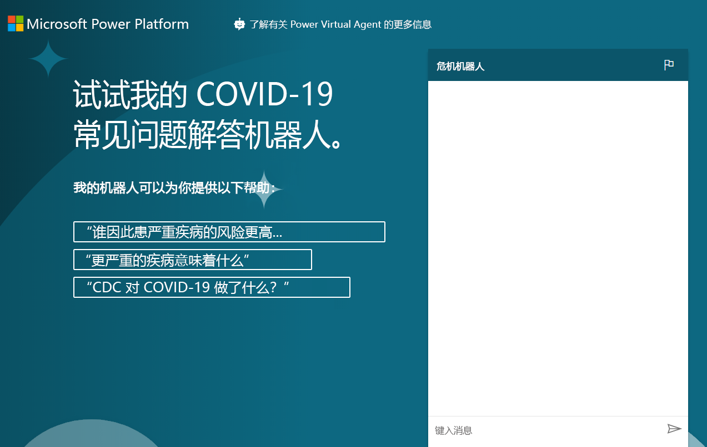

---
lab:
  title: 实验室 8：如何构建基本聊天机器人
  module: 'Module 6: Intro to Power Virtual Agents'
ms.openlocfilehash: ed1611f4b1450093a6e95cbb9df7ad7fdc040e86
ms.sourcegitcommit: ef58c858463b890e923ef808b1d43405423943fd
ms.translationtype: HT
ms.contentlocale: zh-CN
ms.lasthandoff: 01/27/2022
ms.locfileid: "137898849"
---
# <a name="module-6-intro-to-power-virtual-agents"></a>模块 6：Power Virtual Agents 简介
## <a name="lab-how-to-build-a-basic-chatbot"></a>实验室：如何构建基本聊天机器人

# <a name="scenario"></a>方案

Bellows College 是一所教育机构，校园内有多座建筑。 目前，校园访问记录在纸质日报上。 无法始终如一地捕获信息，也无法收集和分析有关整个校园的访问数据。

与大多数组织一样，Bellows College 也迅速对 COVID-19、最佳做法、时间表等方面的错误信息作出了回应。 在本实验室中，你将构建 Power Virtual Agent 聊天机器人，该机器人指向“疾病控制中心”页面，其中包含有关疫情现状的问题和答案。 学院需要这种装置，以便可以将其嵌入到自己的门户网站中，同时也可以在各院系自行计划重新开放时临时使用。

## <a name="high-level-steps"></a>大致步骤

我们将按照以下简要说明来构建 Power Virtual Agent：

  - 注册试用 Power Virtual Agent

  - 使用常见问题解答构建机器人

  - 测试机器人

  - 更改默认问候语

  - 发布机器人

  - 额外挑战：将机器人嵌入门户中

## <a name="prerequisites"></a>先决条件

以下已被确定为完成项目必须满足的要求：

  - 完成“模块 0 实验室 0 - 验证实验室环境”

  - 完成“模块 2 实验室 1 - Microsoft Dataverse 简介”

  - 仅限附加练习：完成实验室 4 模块 6 - Power Apps 门户简介 

## <a name="things-to-consider-before-you-begin"></a>开始前要考虑的事项

机器人在许多不同的情况下非常有用。 根据到目前为止对 Bellows College 的了解，考虑一下机器人在组织中的其他可能用途。

# <a name="exercise-1-sign-up-for-pva-and-create-a-new-bot"></a>练习 \#1：注册 PVA 并创建新的机器人

在本练习中，你将注册 Power Virtual Agents 试用版。

1.  导航到 [Power Virtual Agents](https://powerva.microsoft.com/)

2.  单击“开始免费试用”。

3.  如果需要，请登录。

4. “创建新的机器人”窗口应该会出现。

5. 输入“Crisis Bot”作为名称并选择语言。

6. 选择创建机器人的练习环境，然后单击“创建”。 等待机器人创建完毕。 如果出现提示，则单击“探索机器人”。

7. 测试机器人。 在消息框中键入“Hello”，然后单击“发送” 。 机器人应该会问候你，并告诉你它可以做什么。

8. 关闭“聊天”。

9. 选择“主题”。 机器人自带一些示例用户主题和系统主题。 默认问候语来自系统主题。

> 在下一个练习中，你将基于 CDC 常见问题解答网站生成自己的主题。 不要离开此浏览器窗口。

# <a name="exercise-2-create-topics"></a>练习 \#2：创建主题

在本练习中，你将基于 CDC 常见问题解答网站生成主题。

1.  在新选项卡中，导航到 [CDC 常见问题解答](https://www.cdc.gov/coronavirus/2019-ncov/faq.html)网站并检查网站上的内容。 你将根据这些常见问题解答生成主题。

2.  复制 URL。

3.  返回 Power Virtual Agents，并确保“主题”仍处于选中状态。

4.  选择“主题”下面的“建议”选项卡。

5.  单击“开始使用”。

6. 将你之前复制的 URL 粘贴到“在线内容链接”文本框，然后单击“添加”。 请注意，如果复制了完整 URL， https:// 将列出两次。 确保 URL 仅列出协议一次。

7.  单击“开始”，然后等待。 这会需要几分钟时间。

8.  一些建议的主题应该已经为你创建完成。 单击打开其中一个建议的主题。

9. 你应该会看到触发短语以及机器人回复。 单击“添加到主题”。
    
10. 建议的主题应添加到你的主题中。 选择所有建议的主题，然后单击“添加到主题” 

    > 你可以使用“名称”列左侧的图标选择所有主题。 如果收到错误消息，请重试。

11. 添加建议的主题后，选择“现有”选项卡。你应该会看到状态设置为“关”的新主题。

12. 使用“状态”列的切换按钮将一些主题切换到“开”。 

13. 写下你已打开的某个主题的触发短语，以便稍后进行测试。

> 不要离开此浏览器窗口。

# <a name="exercise-3-test-topics"></a>练习 \#3：测试主题

在此任务中，你将测试所添加的主题。

1.  单击左下角的“测试你的机器人”。

2.  单击“重置”。

3.  键入你在上一个任务中记录的触发短语，然后单击“发送”。

4.  机器人会为你提供正确的信息，并询问它是否回答了你的问题。 单击 **“是”** 。

5.  机器人会询问你其表现如何。 给它一个极好的评级。

6.  机器人会询问是否还有其他事情可帮助你。 单击“不用了，谢谢”。

7.  机器人会结束聊天会话。

8.  键入“你好”，然后单击“发送”。

9.  机器人应该会问候你，并告诉你它可以做什么。 你的机器人现在可以为用户提供 COVID-19 疫情常见问题解答，因此你需要在下一个任务中更改问候语。 不要离开此浏览器窗口。

# <a name="exercise-4-change-the-greeting"></a>练习 \#4：更改问候语

在此任务中，将问候语更改为特定于新冠肺炎的问候语。

1.  确保已选择“主题”，并选择“现有”选项卡。

2.  折叠“用户主题”部分。

3.  单击打开系统主题的“问候”主题。 你也可以使用搜索框来搜索现有主题。

4.  问候主题包含 52 个触发短语，请单击“前往创作画布”。

5.  转到第一条消息并将其替换为 `Hi, I’m a virtual agent. I can tell you about how COVID-19 spreads, how to protect yourself, preparing your home and family for COVID-19, symptoms, testing, and more.`

6.  单击“保存”  。

7.  如果你的机器人仍未打开，请单击“测试机器人”。 单击“重置”以重置聊天。

8.  键入“你好”，然后单击“发送”。

9.  机器人现在应该以新的问候答复。

# <a name="exercise-5-publish-the-bot"></a>练习 \#5：发布机器人

在此练习中，你将发布机器人。

1.  在左侧导航栏中选择“发布”。

2.  单击“发布” 。

3.  再次单击“发布”并等待发布完成。

4.  展开左侧导航栏上的“管理”，然后选择“频道”。

5.  你将获得可发布机器人的可用频道列表。 选择“演示网站”。

6.  将欢迎消息更改为 `Try my COVID-19 FAQ bot.`

7.  在“对话开场白”中输入以下内容：
    ```
     “Who is at higher risk for serious illness from COVID-19”
     “What does more severe illness mean”
     “What is the CDC doing about COVID-19”
    ```
    
8.  单击“保存”  。

9.  复制 URL。

> 你可以与同事共享 URL，并从他们那里获得反馈。 

10.  启动新的浏览器窗口或标签页，然后导航到你复制的 URL。 演示网站应如下图所示。

11. 继续并开始与机器人聊天。  
    
完成后，你发布的机器人应如下所示：



# <a name="challenges"></a>挑战 
* 将你的聊天机器人嵌入到“Bellows College 访客”门户中（有关如何执行此操作的更多信息，请参阅“将机器人添加到 Power Apps”[此处](https://docs.microsoft.com/en-us/power-virtual-agents/publication-connect-bot-to-web-channels)）。
